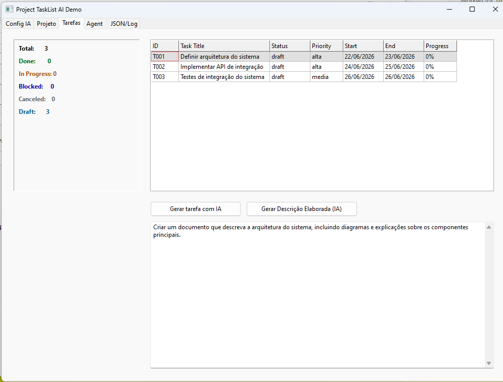
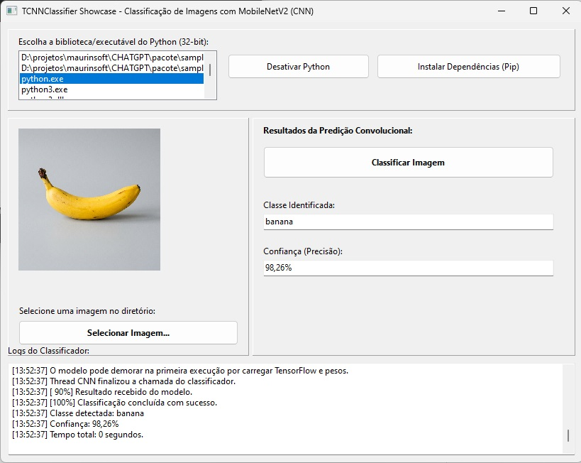
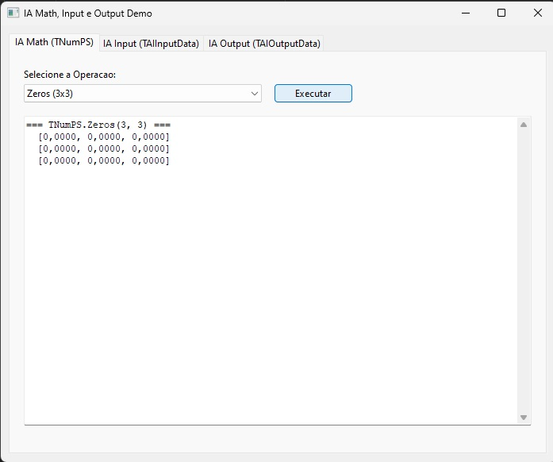
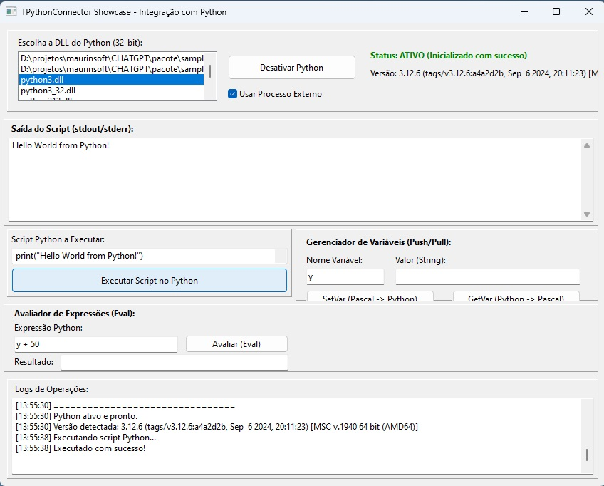
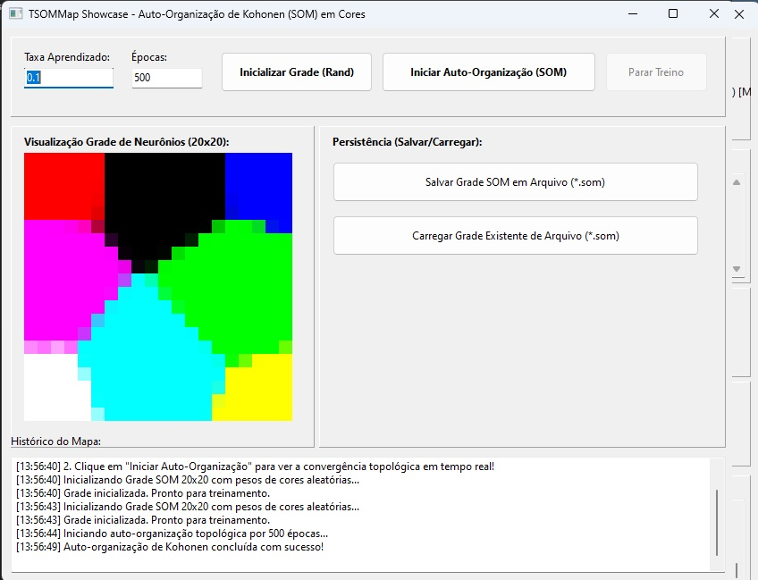
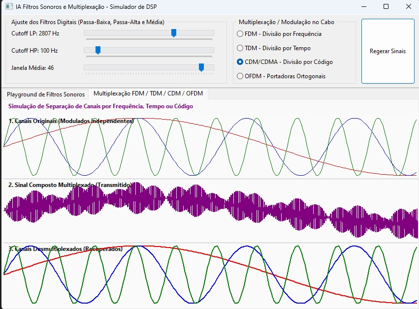
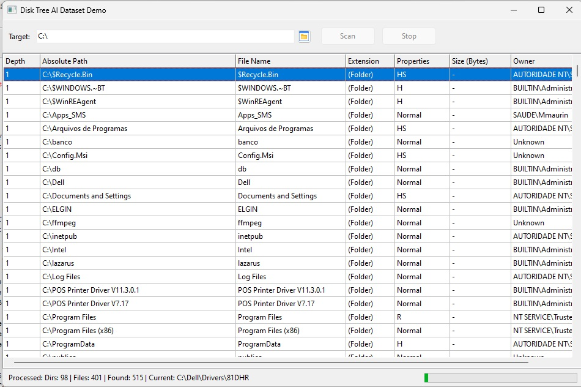
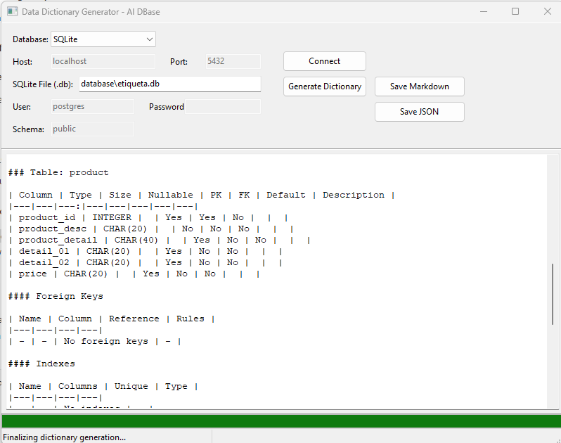
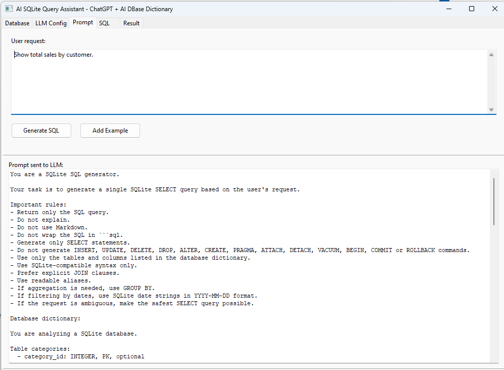

# TCHATGPT — AI Component Suite for Lazarus / Free Pascal

🌍 **Languages / Idiomas**

* [Português (PT-BR)](README.md)
* [English (EN)](README_EN.md)
* [Español (ES)](README_ES.md)
* [Français (FR)](README_FR.md)
* [Italiano (IT)](README_IT.md)
* [العربية (AR)](README_AR.md)
* [中文 (CH)](README_CH.md)
* [Русский (RU)](README_RU.md)
* [日本語 (JP)](README_JP.md)

---

[](https://www.gnu.org/licenses/gpl-3.0)
[](https://www.lazarus-ide.org/)
[](https://www.freepascal.org/)
[]()

> [!WARNING]
> **Aviso Importante de Arquitetura e Integração**:
> 1. A suíte suporta o componente de detecção de pose humana (`TAIHumanPoseDetector`) **exclusivamente em plataformas de 64-bit (x86_64)** no Windows e no Linux. Em sistemas de 32-bit o componente compila normalmente mas reporta-se indisponível em runtime.
> 2. O backend do MediaPipe Pose (`TAIHumanPoseDetector`) oferece suporte completo a execução **SIM (Simulada/Mock)** e **REAL (com detecção de verdade através de um worker em Python)**. Ambas as abordagens estão validadas e funcionais em 64-bit.

---

## Visão geral

**TCHATGPT** é uma suíte open source de componentes visuais e não visuais para **Lazarus / Free Pascal**, criada para facilitar a integração de recursos de Inteligência Artificial em aplicações desktop, industriais, educacionais e corporativas.

O projeto oferece componentes para conexão com provedores de LLM, modelos locais, processamento de dados, aprendizado de máquina simples, voz, imagem, grafos, agentes, canais de entrada/saída, visão computacional e visualização 3D.

> Este projeto deve ser entendido como uma **suíte de componentes para integração de IA em aplicações Lazarus**, e não como uma plataforma completa para substituir frameworks especializados de treinamento, MLOps ou implantação de modelos em larga escala.

---

## Situação atual

O projeto está em desenvolvimento ativo e possui componentes em diferentes níveis de maturidade.

Use a matriz oficial em:

```text
pacote/COMPONENT_STATUS.md
```

Classificação usada:

| Status | Significado |
|---|---|
| Stable | Base consolidada e de baixo risco |
| Beta | Funcional, mas ainda precisa validação ampla |
| Experimental | API ou comportamento ainda pode mudar |
| Placeholder | Estrutura existe, mas ainda não entrega função real completa |
| Deprecated | Mantido apenas por compatibilidade |

---

## Arquitetura modular dos pacotes

A suíte é organizada em pacotes modulares dentro de:

```text
pacote/packages/
```

Para novos projetos, use diretamente os pacotes modulares.

| Pacote | Finalidade | Uso recomendado | Status |
|---|---|---|---|
| `openai_core.lpk` | Componentes centrais, LLM, base comum, utilitários principais e suporte a projetos | **Essencial** | Stable / Beta |
| `openai_python.lpk` | Conectores Python e executores de modelos (TPythonConnector, TYoloDetect, TFaceDetection, TCNNClassifier, TLSTMPredictor, TAIPythonRuntime) | Opcional | Beta / Experimental |
| `openai_ml.lpk` | Machine learning simples e matemática em Pascal (Rede Neural, Perceptron, SOM) | Opcional | Beta / Experimental |
| `openai_graph.lpk` | Grafos, classificação por grafo, exportação e relatórios | Opcional | Beta / Experimental |
| `openai_files.lpk` | Varredura de diretórios, Disk Tree Scanner e gerenciamento físico de arquivos | Opcional | Beta |
| `openai_output.lpk` | Saídas, relatórios, PDF, TXT, geração de arquivos Word/Excel compatíveis | Opcional | Stable / Beta |
| `openai_input.lpk` | Entrada, captura unificada (TAICaptureSource), e-mail, sockets, serial, MQTT, Modbus, Profinet | Opcional | Beta |
| `openai_vision.lpk` | OpenCV, backends nativos de câmera (VFW/V4L2), face e motion tracker, pose detector (MediaPipe 64-bit) | Opcional | Stable / Beta / Exp |
| `openai_image.lpk` | Filtros rápidos de pixel 100% nativos (Grayscale, Negative, Blur, Sobel, etc.) | Opcional | Stable |
| `openai_voice.lpk` | Voz, áudio, sintetizador de texto para fala e filtros sonoros | Opcional | Stable / Beta |
| `openai_simulation.lpk` | Simulações em grade 2D, motor de regras, comportamento e movimentação | Opcional | Experimental |
| `openai_industrial.lpk` | Modbus, MQTT e pontes PLC industriais | Opcional | Beta / Experimental |
| `openai_graphic.lpk` | Visualização 3D, STL/OBJ, avatar e integração Tripo3D | Opcional | Experimental |
| `openai_agent.lpk` | Agentes autônomos, regras de segurança estrita e executores de ação | Opcional | Beta / Experimental |
| `openai_aidbase.lpk` | Dicionários de dados e metadados de bancos de dados para IA (TAIPostgreSQLDictionary, TAISQLiteDictionary, etc.) | Opcional | Beta / Experimental |

> **Nota sobre o Pacote Legado**: O pacote antigo e monolítico `openai.lpk` foi completamente descontinuado e removido. Utilize a estrutura modular acima.

---

## Instalação recomendada no Lazarus

1. Abra o Lazarus.
2. Acesse **Package > Open Package File (.lpk)**.
3. Instale primeiro o pacote essencial:

```text
pacote/packages/openai_core.lpk
```

4. Compile e instale.
5. Instale o pacote `openai_python.lpk` caso deseje utilizar recursos de integração com scripts Python.
6. Instale apenas os pacotes adicionais necessários ao seu projeto.
7. Recompile a IDE quando o Lazarus solicitar.

### Ordem recomendada de instalação

```text
1.  pacote/packages/openai_core.lpk       (Essencial)
2.  pacote/packages/openai_python.lpk     (Opcional - Python Connectors)
3.  pacote/packages/openai_ml.lpk         (Opcional)
4.  pacote/packages/openai_graph.lpk      (Opcional)
5.  pacote/packages/openai_files.lpk      (Opcional)
6.  pacote/packages/openai_output.lpk     (Opcional)
7.  pacote/packages/openai_input.lpk      (Opcional)
8.  pacote/packages/openai_vision.lpk     (Opcional)
9.  pacote/packages/openai_image.lpk      (Opcional)
10. pacote/packages/openai_voice.lpk      (Opcional)
11. pacote/packages/openai_simulation.lpk (Opcional)
12. pacote/packages/openai_industrial.lpk (Experimental)
13. pacote/packages/openai_graphic.lpk    (Experimental)
14. pacote/packages/openai_agent.lpk       (Experimental)
15. pacote/packages/openai_aidbase.lpk     (Opcional - Dicionário de Dados)
```

---

## Dependências externas por pacote

| Pacote | Dependências comuns |
|---|---|
| `openai_core` | Lazarus, FPC, LCL, FCL, OpenSSL para HTTPS. Para componentes de integração Python: Python 3, arquitetura compatível e bibliotecas Python conforme componente |
| `openai_ml` | Sem Python obrigatório; usa Pascal/FPC |
| `openai_graph` | `openai_core`, `openai_ml` |
| `openai_vision` | Para `TAIOpenCV`: Python 3, `opencv-python`, `numpy`. Componentes nativos usam LCL/FPC;usa VFW no Windows |
| `openai_voice` | Windows SAPI ou Linux eSpeak/eSpeak-NG conforme uso |
| `openai_output` | `fpPDF`/FPC para PDF; Word/Excel podem ser HTML compatível |
| `openai_industrial` | Dependências de Modbus/MQTT e permissões do ambiente |
| `openai_graphic` | Dependências gráficas conforme viewer/3D |
| `openai_agent` | Depende de segurança e confirmação explícita para ações reais |

---

## Componentes principais

### AI Core

Componentes centrais:

* `TAIBaseComponent`
* `TCHATGPT`
* `TTokenList`
* `TAICodeAssistant`
* `TAIPromptBuilder`
* `TAIModelRegistry`
* `TAIWizardConfig`
* `TAIProject`
* `TAIPipeline`

> Nota técnica: atualmente `TAIPipeline` ainda está no pacote core, mas ele depende conceitualmente de módulos como agente, input, output, industrial e grafo. A meta futura é separá-lo em um pacote próprio ou reduzir o acoplamento.

### AI Vision

A camada de Visão Computacional do projeto é dividida em duas abordagens:

#### 1. AI Native Vision (100% Lazarus / Free Pascal)

Componentes Pascal, sem dependência de Python, OpenCV ou executores externos. Estão registrados principalmente na aba **`AI Native Vision`** da IDE e utilizam recursos como `TBitmap` e `TLazIntfImage`.

*: captura de câmera/webcam via Windows VFW/`avicap32.dll`. No Linux, a versão atual ainda retorna stub/erro de plataforma não suportada.
* `TAINativeImageFilter`: filtros de imagem nativos, como cinza, threshold, inverter, resize e blur box.
* `TAIImageInfo`: extração nativa de dimensões e informações básicas de imagem.
* `TAIFrameBuffer`: buffer circular de frames em memória para processamento de vídeo.
* `TAIMotionTracker`: detecção de movimento por variação de luminância entre bitmaps.
* `TAIFrameDiff`: geração de mapa de diferença absoluta entre frames.
* `TAIFaceTracker`: rastreador local baseado em template matching/SAD. Não é detector facial semântico.

Samples nativos previstos ou em validação:

* `pacote/samples/AI Native Vision/camera_capture_demo/`
* `pacote/samples/AI Native Vision/native_image_filter_demo/`
* `pacote/samples/AI Native Vision/motion_tracker_demo/`

#### 2. AI Python Vision (Integração Externa)

Componentes que realizam chamadas ou utilizam scripts Python externos para executar tarefas mais pesadas:

* `TAIOpenCV`: funcional via worker Python. Possui sample funcional em `pacote/samples/AI Vision/opencv_filter_demo/`.
  * Recursos atuais do `TAIOpenCV`: `SelfTest`, `Image Info`, `Gray`, `Blur`, `Canny`, `Threshold`, `Resize`.
  * Dependências do OpenCV Python: `pip install opencv-python numpy`.

#### 3. AI MediaPipe Vision (Nativo via Bridge DLL/SO)

| Componente | Pacote | Backend | Função | Status |
|---|---|---|---|---|
| `TAIHumanPoseDetector` | `openai_vision.lpk` | MediaPipe Bridge DLL/SO | Detecta pose humana, retorna 33 landmarks corporais reais e simulação integrada | Estável (64-bit) |

##### Runtime MediaPipe

O componente `TAIHumanPoseDetector` usa runtime versionado em:

`runtime/mediapipe/pose/mp_0_10_35/`

A DLL/SO da bridge deve informar:

- versão da bridge;
- ABI da bridge;
- versão compatível do MediaPipe;
- plataforma;
- arquitetura;
- modelo `.task` usado.

O componente Pascal valida essas informações antes de inicializar.

### AI Output

Componentes de documentos e saídas. Atenção: quando a saída Word/Excel for feita por HTML compatível, a documentação do componente deve indicar isso claramente, sem prometer DOCX/XLSX nativo.

### AI Agent

Agentes são experimentais e devem ser usados com segurança. Ações reais de arquivo, rede, e-mail, industrial ou automação devem exigir configuração explícita e validação do usuário.

---

## Provedores de LLM

| Provedor | Enum | Tipo |
|---|---|---|
| OpenAI | `AIP_OPENAI` | API externa |
| OpenRouter | `AIP_OPENROUTER` | API externa/agregador |
| Cerebras | `AIP_CEREBRAS` | API externa |
| Google Gemini | `AIP_GEMINI` | API externa |
| Anthropic Claude | `AIP_CLAUDE` | API externa |
| Local/Ollama/compatível | `AIP_LOCAL` | Servidor local |

> Modelos, custos, limites e disponibilidade mudam conforme cada provedor. Sempre confira a documentação oficial do serviço usado.

---

## Samples

Os projetos de demonstração ficam em:

```text
pacote/samples/
```

Sample atualmente consolidado:

| Sample | Tipo | Pacote | Dependência externa | Status |
|---|---|---|---|---|
| `opencv_filter_demo` | GUI | `openai_vision` | Python + OpenCV | Funcional/Beta |

Samples nativos em validação/documentação:

| Sample | Tipo | Pacote | Dependência externa | Status |
|---|---|---|---|---|
| `camera_capture_demo` | GUI | `openai_vision` | Webcam VFW no Windows | Em validação |
| `native_image_filter_demo` | GUI | `openai_vision` | Nenhuma | Previsto/em validação |
| `motion_tracker_demo` | GUI | `openai_vision` | Nenhuma | Previsto/em validação |

---


---

## Screenshots

> As imagens abaixo demonstram recursos já testados ou atualmente em desenvolvimento.
> Componentes novos podem não ter ainda demonstrações visuais completas.

### AI Project Demo



Demonstração do gerador e gerenciador de projetos e tarefas (Gantt, Timeline) integrados com IA.

### CNN Demo



Demonstração de classificação de imagens.

### Math Input / Output Demo



Demonstração de componentes matemáticos.

### Python Connector Demo



Demonstração de integração com Python.

### SOM Demo



Demonstração de mapa auto-organizado.

### Sound Filters Demo



Demonstração de filtros de som.

### Voice Synthesizer Demo


Demonstração de síntese de voz.

### Disk Tree AI Dataset Demo



Varredura assíncrona do sistema de arquivos e preparação do inventário de datasets de IA.

### DB Dictionary Demo



Geração de dicionário de dados a partir de conexões de banco de dados (PostgreSQL e SQLite) para alimentação de prompts de IA.

### AI SQLite Query Assistant Demo



Interface para geração e execução segura de consultas SQLite (SELECT) por meio de linguagem natural, integrada ao ChatGPT e dicionário de metadados da ZeosLib.

---

## Limitações conhecidas

* O projeto ainda está em desenvolvimento.
* Nem todos os componentes possuem demonstração completa.
* Alguns componentes são placeholders ou experimentais.
* Integrações externas dependem de APIs, bibliotecas e permissões de terceiros.
* Componentes Python dependem de versão, arquitetura e ambiente compatíveis.
* É recomendado validar cada componente antes de uso em produção.
* Testes automatizados e integração contínua ainda precisam ser ampliados.
* `TAIFaceTracker` rastreia template, não detecta rosto semanticamente.

---

## Roadmap

### Curto prazo

* validar compilação dos pacotes modulares em Windows e Linux;
* manter `COMPONENT_STATUS.md` atualizado;
* completar documentação técnica por aba;
* criar pelo menos um sample real por pacote principal;
* revisar o acoplamento do `TAIPipeline`.

### Médio prazo

* criar testes automatizados com `lazbuild`;
* criar releases versionadas;
* documentar dependências externas por componente;
* melhorar tratamento de erros;
* consolidar OpenCV, grafos, output e agentes.

### Longo prazo

* criar templates de projetos;
* criar assistente visual de configuração;
* consolidar componentes 3D;
* melhorar integração com modelos locais;
* evoluir agentes com controle de segurança;
* criar documentação de produção.

---

## Para quem este projeto é indicado?

* Desenvolvedores Lazarus/Free Pascal.
* Professores e estudantes.
* Projetos desktop com IA.
* Automação local.
* Sistemas corporativos legados.
* Prototipação de IA.
* Integração de IA com dispositivos e aplicações existentes.

---

## Para quem este projeto ainda não é indicado?

Neste momento, o projeto ainda não substitui:

* frameworks completos de machine learning;
* plataformas de MLOps;
* pipelines corporativos de treinamento;
* serviços profissionais de deploy de modelos;
* bibliotecas especializadas como PyTorch, TensorFlow, scikit-learn ou OpenCV completo;
* infraestrutura de IA em escala empresarial.

---

## Contribuindo

Contribuições são bem-vindas, especialmente em:

* correção de bugs;
* samples funcionais;
* documentação;
* testes automatizados;
* compatibilidade Windows/Linux;
* validação dos pacotes modulares;
* melhorias de segurança;
* integração com provedores de IA.

---

## Licença

Este projeto está licenciado sob a **GNU General Public License v3.0**.

Consulte o arquivo `LICENSE`.

---

## Aviso

Este projeto utiliza ou integra serviços externos de IA. O uso desses serviços pode envolver custos, limites de API, políticas próprias e envio de dados para terceiros.

Antes de usar em produção:

* revise os termos do provedor;
* proteja suas chaves de API;
* não envie dados sensíveis sem autorização;
* valide segurança, privacidade e conformidade;
* teste o comportamento do componente no ambiente real.