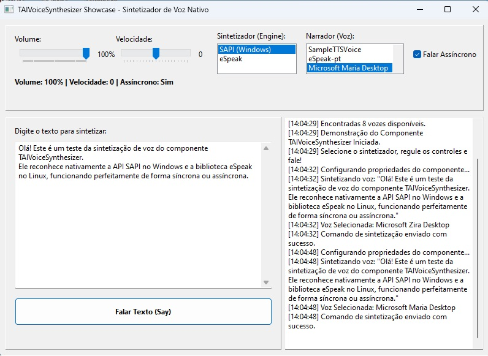

# TCHATGPT — AI Component Suite for Lazarus / Free Pascal

🌍 **Languages / Lingue**

* [Português (PT-BR)](README.md)
* [English (EN)](README_EN.md)
* [Español (ES)](README_ES.md)
* [Français (FR)](README_FR.md)
* [Italiano (IT)](README_IT.md)
* [العربية (AR)](README_AR.md)

---

---

## Panoramica

**TCHATGPT** è una suite open source di componenti visivi e non visivi per **Lazarus / Free Pascal**, progettata per facilitare l’integrazione di risorse di Intelligenza Artificiale in applicazioni desktop, industriali, educative e aziendali.

Il progetto offre componenti per la connessione a provider LLM, modelli locali, elaborazione dei dati, machine learning, sintesi vocale, elaborazione di immagini, agenti, grafi, canali di input e output, oltre a componenti sperimentali per computer vision e risorse grafiche 3D.

> Questo progetto deve essere inteso come una **suite di componenti per l’integrazione dell’IA in applicazioni Lazarus**, e non come una piattaforma completa di IA destinata a sostituire framework specializzati di addestramento, piattaforme MLOps o infrastrutture di deployment di modelli su larga scala.

---

## Obiettivo del progetto

L’obiettivo principale è permettere agli sviluppatori Lazarus / Free Pascal di aggiungere capacità di IA ai propri sistemi in modo semplice, riutilizzabile e basato su componenti.

La suite mira a supportare scenari come:

* assistenti con IA generativa;
* integrazione con API di LLM;
* utilizzo di modelli locali tramite server compatibili;
* generazione e analisi di dataset;
* classificazione semplice di testi;
* automazione basata su agenti;
* sintesi vocale;
* elaborazione di base delle immagini;
* filtri digitali audio;
* integrazione con dispositivi, sensori e canali esterni;
* prototipazione di applicazioni IA in Lazarus.

---

## Stato attuale del progetto

Il progetto è in sviluppo attivo e contiene componenti con diversi livelli di maturità.

### Componenti più consolidati

* `TCHATGPT`
* `TAIBaseComponent`
* `TNeuralNetwork`
* `TTokenList`
* `TAICodeAssistant`
* `TAIDatasetGenerator`
* `TAIVoiceSynthesizer`
* filtri immagine
* filtri audio
* componenti per grafi e dataset

### Componenti sperimentali o in evoluzione

* integrazione con Python;
* componenti CNN, YOLO, LSTM e SOM;
* componenti per agenti autonomi;
* componenti avanzati di input e output;
* componenti OpenCV;
* visualizzazione 3D;
* integrazione con Tripo3D;
* componenti industriali, camera, audio, browser, MQTT, Modbus e CCTV.

---

## Schede dei componenti del pacchetto

Il pacchetto installa componenti nella palette di Lazarus, organizzati per area funzionale.

---

## AI Core

Componenti principali per IA generativa, machine learning e supporto al progetto.

### `TCHATGPT`

Connettore principale per provider di IA generativa.

Permette di inviare prompt, configurare provider, selezionare modelli e ricevere risposte strutturate.

Provider previsti o supportati:

* OpenAI;
* Google Gemini;
* Anthropic Claude;
* OpenRouter;
* Cerebras;
* server locale compatibile con `/v1/chat/completions`;
* Ollama o servizi locali simili.

### `TNeuralNetwork`

Rete neurale multistrato semplice implementata in Pascal.

Permette di:

* creare reti locali;
* configurare input, livelli nascosti e output;
* addestrare per epoche;
* calcolare la perdita;
* salvare e caricare modelli.

### `TTokenList`

Componente di utilità per la tokenizzazione di base del testo.

Può essere utilizzato per:

* classificazione;
* analisi testuale;
* preprocessing;
* grafi decisionali;
* preparazione di dataset.

### `TAICodeAssistant`

Assistente di codice basato su LLM.

Può essere utilizzato per:

* revisionare codice;
* suggerire miglioramenti;
* generare commenti;
* spiegare blocchi di codice;
* assistere nei test;
* convertire o documentare routine.

### `TAIDatasetGenerator`

Generatore di dataset per addestramento, fine-tuning o classificazione locale.

Supporta o mira a supportare strutture come:

* CSV;
* JSON;
* JSONL;
* matrici di input e output per addestramento locale.

### `TAIModelRegistry`

Registro centrale di modelli, provider, endpoint e parametri.

Aiuta a organizzare:

* nome del modello;
* provider;
* endpoint;
* temperatura;
* limite di token;
* parametri predefiniti.

### `TAIWizardConfig`

Assistente di configurazione per nuovi progetti di IA.

Può essere utilizzato per preparare progetti come:

* chatbot;
* classificatore;
* pipeline;
* agente;
* assistente tecnico.

---

## AI Sound Filters

Componenti per l’elaborazione digitale del segnale e il filtraggio audio.

### `TLowPassFilter`

Filtro passa-basso IIR di primo ordine.

Utilizzato per attenuare variazioni rapide e ridurre rumore ad alta frequenza.

### `THighPassFilter`

Filtro passa-alto IIR di primo ordine.

Utilizzato per rimuovere componenti a bassa frequenza, offset o rumore DC.

### `TAverageFilter`

Filtro a media mobile.

Utilizzato per una semplice attenuazione dei segnali.

### `TFDMMultiplexer`

Componente di multiplexing a divisione di frequenza.

Permette di simulare canali in diverse bande di frequenza.

### `TTDMMultiplexer`

Componente di multiplexing a divisione di tempo.

Permette di intercalare canali tramite slot temporali.

### `TCDMMultiplexer`

Multiplexer CDM/CDMA.

Utilizza codici ortogonali per separare i segnali.

### `TOFDMMultiplexer`

Multiplexer OFDM con uso di FFT/IFFT.

Utile per studi e simulazioni di telecomunicazioni.

---

## AI Image

Componenti per l’elaborazione di base delle immagini.

### `TGrayscaleFilter`

Converte immagini in scala di grigi.

### `TNegativeFilter`

Applica inversione dei colori.

### `TBrightnessContrastFilter`

Regola luminosità e contrasto.

### `TBinarizationFilter`

Applica sogliatura per generare immagini in bianco e nero.

### `TBlurFilter`

Applica attenuazione tramite convoluzione.

### `TSharpenFilter`

Migliora la nitidezza utilizzando un kernel di convoluzione.

### `TSobelFilter`

Rileva bordi tramite operatore Sobel.

### `TErosionDilationFilter`

Esegue operazioni morfologiche di erosione e dilatazione.

---

## AI Schedule

Componenti per organizzazione, persistenza e gestione delle dipendenze tra attività.

### `TJSONGroupStorage`

Componente per archiviazione di dati raggruppati in JSON.

Può essere utilizzato per:

* salvare configurazioni;
* persistere parametri;
* memorizzare testi;
* organizzare dati per gruppi.

### `TIASchedule`

Gestore di attività con controllo delle dipendenze.

Permette di modellare:

* attività padre;
* attività figlia;
* dipendenze;
* stato di disponibilità;
* controllo semplice di esecuzione.

---

## AI Voice

Componenti per sintesi vocale.

### `TAIVoiceSynthesizer`

Componente Text-to-Speech.

Su Windows può utilizzare SAPI.
Su Linux può utilizzare eSpeak/eSpeak-NG.

Funzionalità principali:

* leggere testo ad alta voce;
* regolare volume;
* regolare velocità;
* elencare le voci disponibili;
* esecuzione asincrona;
* integrazione con applicazioni desktop.

---

## AI Agent

Componenti per agenti intelligenti e decisioni strutturate.

### `TAIAgent`

Componente orchestratore dell’agente.

Permette di inviare istruzioni a un LLM, interpretare risposte strutturate e coordinare azioni.

### `TAIAgentOptions`

Memorizza contesto, domande, direttive e regole di analisi.

### `TAIAgentAction`

Definisce le azioni consentite per l’agente.

Permette di configurare:

* azioni disponibili;
* parametri attesi;
* callback di esecuzione.

### `TAIAgentResource`

Rappresenta risorse esterne che possono essere attivate dall’agente.

Esempi:

* file;
* email;
* HTTP;
* SMS;
* WhatsApp;
* TCP/UDP;
* Web APIs.

### `TAIAgentOutput`

Livello di output che collega le decisioni dell’agente alle risorse reali del sistema.

---

## AI Graph

Componenti per strutturazione dei dati, grafi e dataset.

### `TAIGraphMap`

Grafo ponderato per classificazione e analisi basata su token.

Può essere utilizzato per:

* classificazione testuale;
* raggruppamento di concetti;
* relazioni tra termini;
* analisi semplice di argomenti.

### `TAITrainingExporter`

Esportatore di dati di addestramento.

Formati previsti o supportati:

* CSV;
* JSON;
* JSONL;
* ARFF;
* vettori numerici.

### `TAIDatasetAnalyzer`

Analizzatore della qualità del dataset.

Può rilevare:

* categorie vuote;
* duplicati;
* squilibrio delle classi;
* testi troppo brevi;
* testi troppo lunghi.

### `TAITrainingReport`

Generatore di report tecnici di addestramento.

Può registrare:

* accuratezza;
* errore;
* perdita;
* numero di token;
* confidenza media;
* statistiche del dataset.

### `TAIGraphVisualizer`

Esportatore e visualizzatore di grafi.

Formati previsti o supportati:

* DOT / GraphViz;
* Mermaid;
* JSON di visualizzazione.

---

## AI Input

Componenti per input dati e integrazione con fonti esterne.

Questa scheda raccoglie componenti orientati alla cattura di informazioni, comunicazione e integrazione con dispositivi o sistemi.

Componenti previsti o in evoluzione:

* camera;
* audio;
* server web;
* socket;
* comunicazione seriale;
* stampante POS;
* CCTV/IP;
* Modbus;
* MQTT;
* email;
* messaggistica;
* cattura del sistema operativo;
* browser integrato;
* input industriali.

> Alcuni componenti di questa scheda possono richiedere librerie esterne, driver, permessi del sistema operativo o servizi aggiuntivi.

---

## AI Output

Componenti per output dati, generazione di documenti e integrazione con destinazioni esterne.

Risorse previste o in evoluzione:

* generazione di documenti;
* esportazione di risposte;
* output strutturato;
* integrazione con canali esterni;
* automazione delle risposte.

---

## AI Vision

Componenti per computer vision.

Componenti previsti o in evoluzione:

* OpenCV;
* cattura camera;
* elaborazione frame;
* tracciamento facciale;
* tracciamento movimento;
* classificazione immagini;
* rilevamento oggetti.

> Quest’area deve essere considerata sperimentale finché i componenti non dispongono di dimostrazioni complete, dipendenze documentate e test di integrazione.

---

## AI Graphic

Componenti grafici e 3D legati a IA, simulazione e visualizzazione.

Componenti previsti o in evoluzione:

* scena 2D/3D;
* ambiente di addestramento;
* simulatore fisico;
* sensori virtuali;
* funzione di ricompensa;
* visualizzazione di modelli 3D;
* rig scheletrico;
* controller avatar;
* libreria di pose;
* sequenza di animazione;
* integrazione con generazione di modelli 3D.

### `TAI3DModelViewer`

Visualizzatore di modelli 3D.

Obiettivo:

* caricare modelli 3D;
* visualizzare mesh;
* ruotare;
* zoomare;
* ridurre lo zoom;
* alternare tra modalità solida, wireframe e punti.

### `TAITripo3DClient`

Client per integrazione con un servizio esterno di generazione di modelli 3D.

Obiettivo:

* generare modello da testo;
* generare modello da immagine;
* generare modello da più immagini;
* scaricare il modello 3D risultante.

> L’integrazione con servizi esterni deve essere validata secondo la documentazione ufficiale dell’API del provider utilizzato.

---

## Installazione del pacchetto in Lazarus

1. Aprire Lazarus.
2. Accedere a **Package > Open Package File (.lpk)**.
3. Selezionare il file `pacote/packages/openai_core.lpk`.
4. Fare clic su **Compile**.
5. Quindi fare clic su **Use > Install**.
6. Lazarus richiederà di ricompilare l’IDE.
7. Dopo il riavvio, i componenti appariranno nella palette dei componenti.

---

## Provider LLM

| Provider                     | Enum             | Tipo                      |
| ---------------------------- | ---------------- | ------------------------- |
| OpenAI                       | `AIP_OPENAI`     | API esterna               |
| OpenRouter                   | `AIP_OPENROUTER` | API esterna / aggregatore |
| Cerebras                     | `AIP_CEREBRAS`   | API esterna               |
| Google Gemini                | `AIP_GEMINI`     | API esterna               |
| Anthropic Claude             | `AIP_CLAUDE`     | API esterna               |
| Local / Ollama / compatibile | `AIP_LOCAL`      | Server locale             |

> Nomi dei modelli, limiti, costi e disponibilità possono cambiare in base a ciascun provider. Consultare sempre la documentazione ufficiale del servizio utilizzato.

---

## Requisiti

### Ambiente principale

* Lazarus 3.x o superiore;
* versione compatibile di Free Pascal;
* Windows o Linux;
* pacchetto `openai_core.lpk`;
* connessione internet per provider esterni;
* server locale configurato quando vengono utilizzati modelli offline.

### Windows

Per la comunicazione HTTPS, possono essere necessarie DLL OpenSSL compatibili con l’architettura dell’applicazione.

Verificare la cartella `pacote/lib/`.

Si consiglia di copiare le DLL necessarie nella stessa cartella dell’eseguibile finale.

### Linux

A seconda dei componenti utilizzati, potrebbero essere necessari pacchetti aggiuntivi, come:

* OpenSSL;
* eSpeak/eSpeak-NG;
* libpython;
* librerie camera o audio;
* librerie specifiche per computer vision.

I requisiti possono variare in base al componente utilizzato.

---

## Screenshots

> Le immagini seguenti mostrano funzionalità già testate o attualmente in sviluppo.
> I nuovi componenti potrebbero non avere ancora dimostrazioni visive complete.

### CNN Demo

Dimostrazione di classificazione immagini.

### Math Input / Output Demo

Dimostrazione dei componenti matematici.

### Python Connector Demo

Dimostrazione di integrazione con Python.

### SOM Demo

Dimostrazione di mappa auto-organizzante.

### Sound Filters Demo

Dimostrazione dei filtri audio.

### Voice Synthesizer Demo

Dimostrazione della sintesi vocale.

### Disk Tree AI Dataset Demo

Scansione asincrona del file system e preparazione dell'inventario del dataset IA.

---

## Limitazioni note

Il progetto è ancora in sviluppo e contiene componenti con diversi livelli di stabilità.

Limitazioni attuali previste:

* alcuni componenti possono essere ancora sperimentali;
* non tutti i componenti dispongono di dimostrazioni complete;
* le integrazioni esterne dipendono da API di terze parti;
* i componenti di computer vision possono richiedere librerie esterne;
* i componenti Python dipendono da versioni e architetture compatibili;
* ogni componente deve essere validato prima dell’uso in produzione;
* test automatizzati e integrazione continua devono essere ancora ampliati.

---

## Roadmap

### Breve termine

* revisionare la documentazione dei componenti;
* standardizzare i nomi delle schede in inglese;
* separare componenti stabili e sperimentali;
* aggiungere dimostrazioni minime per ogni componente;
* validare la compilazione del pacchetto su Windows e Linux;
* correggere incoerenze tra README e codice sorgente.

### Medio termine

* creare test automatizzati;
* creare una pipeline con `lazbuild`;
* creare release versionate;
* documentare dipendenze esterne;
* migliorare la gestione degli errori;
* creare dimostrazioni reali con LLM, voce, immagini e agenti.

### Lungo termine

* creare template di progetto;
* creare un assistente visuale per configurazione IA;
* consolidare i componenti OpenCV;
* consolidare i componenti 3D;
* migliorare l’integrazione con modelli locali;
* evolvere gli agenti con controllo di sicurezza;
* creare documentazione completa per uso in produzione.

---

## A chi è destinato questo progetto?

Questo progetto è indicato per:

* sviluppatori Lazarus;
* sviluppatori Free Pascal;
* docenti e studenti;
* progetti desktop con IA;
* automazione locale;
* sistemi aziendali legacy;
* applicazioni educative;
* prototipi di IA;
* integrazione dell’IA con dispositivi;
* sistemi che necessitano di IA senza migrare tutta la base di codice a Python o JavaScript.

---

## A chi non è ancora destinato questo progetto?

In questa fase, il progetto non sostituisce:

* framework completi di machine learning;
* piattaforme MLOps;
* pipeline aziendali di addestramento;
* servizi professionali di deployment dei modelli;
* librerie specializzate come PyTorch, TensorFlow, scikit-learn o OpenCV completo;
* infrastrutture IA su scala enterprise.

---

## Contribuire

I contributi sono benvenuti.

Aree prioritarie per contribuire:

* correzione di bug;
* dimostrazioni funzionali;
* documentazione;
* test automatizzati;
* compatibilità Windows/Linux;
* icone e screenshots;
* validazione dei componenti;
* miglioramenti nella gestione degli errori;
* integrazione con provider IA;
* demo per ogni scheda di componenti Lazarus.

---

## Licenza

Questo progetto è rilasciato sotto la **GNU General Public License v3.0**.

Consultare il file `LICENSE`.

---

## Avviso

Questo progetto utilizza o integra servizi esterni di IA.
L’uso di questi servizi può comportare costi, limiti API, politiche specifiche dei provider e trasmissione di dati a terze parti.

Prima dell’uso in produzione:

* verificare i termini del provider;
* proteggere le chiavi API;
* non inviare dati sensibili senza autorizzazione;
* validare sicurezza, privacy e conformità;
* testare il comportamento del componente nell’ambiente reale.

---

## Conclusione

**TCHATGPT** è una suite promettente per portare risorse di IA nell’ecosistema Lazarus / Free Pascal.

Il suo principale valore è offrire un ponte pratico tra applicazioni tradizionali e risorse moderne di IA, permettendo a sistemi desktop, industriali, educativi e aziendali di incorporare LLM, voce, immagini, grafi, automazione e modelli locali in modo componentizzato.

Il progetto è ancora in evoluzione, ma possiede già una base importante per diventare un riferimento open source di componenti IA per Lazarus.
