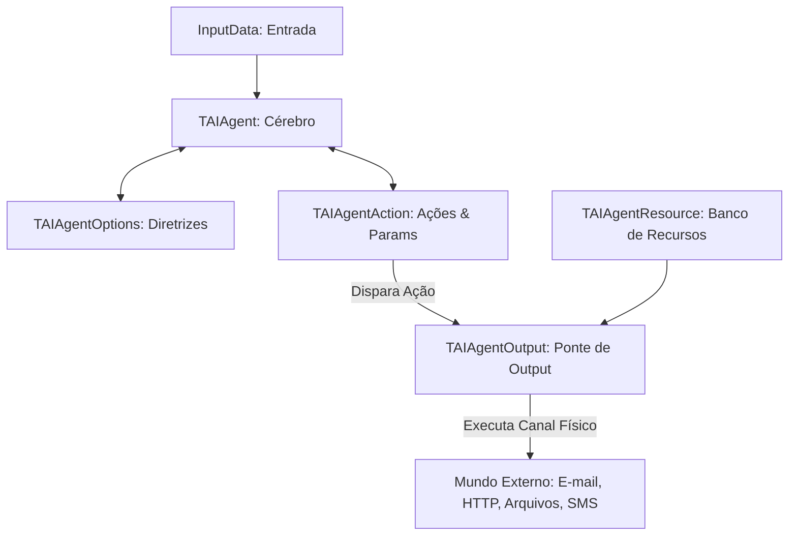

# Playground de Agente Autônomo e Tomada de Decisão (TAIAgent)

Este projeto demonstra a utilização prática do novo conjunto de componentes autônomos sob a aba **AI Agent** do Lazarus IDE. A aplicação exemplifica como configurar agentes inteligentes capazes de receber instruções, analisar contextos do mundo real e escolher a melhor ação a ser executada externamente por meio de recursos físicos com retorno estruturado via JSON nativo.

## Visão Geral

O projeto consiste em um dashboard interativo (Playground) para testar e validar o comportamento de agentes inteligentes em cenários dinâmicos. A aplicação vem pré-carregada com dois cenários simulados:
1. **Alerta de Servidor (Infraestrutura/TI)**: O agente monitora a temperatura de um servidor crítico e despacha comandos de resfriamento (salvando o log real `thermal_log.txt` em disco) ou notifica a manutenção via E-mail.
2. **Ticket de Entrega (Comércio Eletrônico)**: O agente faz a triagem de mensagens de clientes e encaminha para departamentos como financeiro ou logística via WhatsApp.

---

## Funcionalidades Principais

* **Orquestração de Agente Autônomo**: Integração nativa do componente `TAIAgent` com o conector `TCHATGPT`.
* **Diretrizes e Contexto Flexíveis**: Definição dinâmica de perguntas (`TAIAgentOptions.Questions`) e contexto operacional (`Context`) do agente.
* **Ações Estruturadas com Parâmetros**: Configuração de ações permitidas no mundo externo (`TAIAgentAction.AllowedActions`) e parametrização exigida (`ParameterDefinitions`).
* **Sistemas de Recursos Físicos (`TAIAgentResource`)**: Declaração de recursos reais de disparo como:
  * **E-mail** (Simulado com logs detalhados de remetente, destinatário e assunto).
  * **Escrita de Arquivos** (Escrita física real no disco local de logs e relatórios gerados).
  * **WhatsApp / SMS** (Mensagens estruturadas para contatos).
  * **TCP / UDP** (Comunicação de rede por sockets de rede).
  * **Web API** (Requisições HTTP POST físicas reais usando `TFPHttpClient` nativo do Free Pascal).
* **Mapeamento Inteligente de Ações (`TAIAgentOutput`)**: Um componente que mapeia a ação decidida pela IA (`ActionName`) a um recurso físico específico (`ResourceName`), executando o recurso automaticamente e gerando logs operacionais visíveis no formulário.
* **Parsing de JSON Nativo**: Processamento nativo da resposta do LLM sem quebras na presença de markdown wrappers (` ```json `).

---

## Como Funciona

A arquitetura do Agente baseia-se na cooperação entre os seguintes componentes:



### Código de Inicialização e Ligação

```pascal
// Instanciação e ligação dos componentes em tempo de execução
FChatGPT := TCHATGPT.Create(Self);
FAIAgent := TAIAgent.Create(Self);
FAIAgentOptions := TAIAgentOptions.Create(Self);
FAIAgentAction := TAIAgentAction.Create(Self);
FAIAgentResource := TAIAgentResource.Create(Self);
FAIAgentOutput := TAIAgentOutput.Create(Self);

// Vinculação de dependências do Agente
FAIAgent.ChatGPT := FChatGPT;
FAIAgent.Options := FAIAgentOptions;
FAIAgent.Action := FAIAgentAction;
FAIAgentOptions.Action := FAIAgentAction;

// Vinculação do sistema de saídas físicas (Outputs)
FAIAgentOutput.Action := FAIAgentAction;
FAIAgentOutput.Resource := FAIAgentResource;
FAIAgentOutput.OnOutputExecuted := @OnAgentOutputExecuted;
```

---

## Como Compilar e Executar

### Pré-requisitos
* Lazarus IDE instalado com Free Pascal Compiler (FPC) 3.2.2 ou superior.
* Pacote `openai_core.lpk` devidamente compilado e instalado no seu ambiente Lazarus.

### Passos de Compilação
1. Abra o arquivo de projeto `agent_demo.lpi` no Lazarus.
2. Compile a aplicação pressionando `Ctrl + F9` ou selecione o menu **Executar > Construir**.
3. Como alternativa via linha de comando (CLI):
   ```powershell
   C:\lazarus\lazbuild.exe agent_demo.lpi
   ```

### Executando a Demonstração
1. Execute o arquivo executável gerado `agent_demo.exe`.
2. Configure seu provedor de IA no painel superior e preencha o token API (caso use OpenAI/Gemini/Claude).
3. Selecione um dos cenários de demonstração ("Alerta de Servidor" ou "Ticket de Entrega") para preencher instantaneamente as regras de negócio.
4. Clique em **Executar Decisão do Agente** e veja a tomada de decisão do LLM em tempo real e o recurso físico correspondente sendo disparado no painel à direita!
