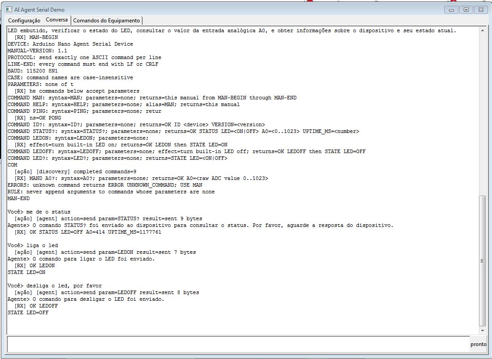

# Agent Serial Demo

Sample visual do `TAIAgentSerial` com configuração completa da LLM, memória de
sessão e controle serial real sob confirmação do usuário.

Todos os componentes visuais e não-visuais estão declarados em design-time no
`main.lfm`: `TCHATGPT`, `TAISerialModem`, `TAIListSerialDevices`,
`TAIAgentSerial`, `TAIAgentAction`, `TAIAgentMemoryMap`, grid, botões e timer.

## Interface



## Abas

### Configuração

Permite escolher todas as opções principais do `TCHATGPT`, incluindo provider,
modelo, token, URL, servidor local, máximo de tokens, instruções Dev e campos
do OpenRouter. Também permite selecionar porta e baud rate e testar a LLM.

As opções de porta e baud são aplicadas imediatamente ao `TAISerialModem`. Se a
configuração mudar durante uma conexão, a porta atual é fechada antes da troca.
Ao clicar em **Iniciar**, os valores também são registrados no
`TAIAgentMemoryMap`. A abertura da conexão, o envio e a leitura continuam sendo
solicitados pelo `TAIAgentSerial` somente quando necessários e após confirmação.

### Conversa

Mostra o histórico, ações e dados RX. Digite o prompt na parte inferior e
pressione Enter. Cada pergunta e resposta é registrada no MemoryMap e o
contexto acumulado é enviado ao agente.

### Comandos do Equipamento

Mostra o catálogo realmente publicado pelo dispositivo, com comando,
descrição, origem e estado ativo. Permite redescobrir, limpar ou copiar o
catálogo. A aba também mostra o estado da descoberta e o estado físico do LED.

## Descoberta determinística pelo MAN

Ao conectar, o `TAIAgentSerial` envia `MAN` automaticamente. Um parser de
linhas, sem participação da LLM, espera `MAN-BEGIN`, interpreta cada linha
`COMMAND <nome>: <descrição>` e conclui somente ao receber `MAN-END`:

```text
MAN-BEGIN
DEVICE: Arduino Agent Serial Device
BAUD: 115200 8N1
COMMAND LEDON: turn the built-in LED on
COMMAND LEDOFF: turn the built-in LED off
COMMAND LED?: return the built-in LED state
COMMAND MAN: show this operation manual
MAN-END
```

O `TAIAgentAction` é o catálogo operacional: `AllowedActions` guarda os nomes e
`ParameterDefinitions` guarda sintaxe e descrição. As ações `connect`, `read`,
`send`, `status` e semelhantes pertencem ao agente serial; `LEDON`, `LED?` e
outros itens descobertos são comandos do dispositivo.

Antes de qualquer ação `send`, o primeiro token é validado no catálogo. `MAN` é
sempre permitido durante a descoberta. Comandos inexistentes são bloqueados e
não chegam à porta serial. A lista válida é acrescentada ao prompt da IA, mas a
LLM nunca interpreta as linhas do manual.

Uma descoberta completa gera uma única etapa `SerialCommandDiscovery` no
`TAIAgentMemoryMap`. O mapa registra o histórico; a fonte principal dos
comandos continua sendo o `TAIAgentAction`.

O `TTimer` do formulário chama `Poll` continuamente enquanto a porta estiver
ativa. Isso é necessário para receber o manual e demais respostas sem depender
de uma nova pergunta do usuário. Não há simulação: toda comunicação usa a
serial real.

O estado do LED é separado do catálogo. Somente `STATE LED=ON` e
`STATE LED=OFF` atualizam a interface; `OK LEDON` confirma apenas que o comando
foi aceito.

Fluxo de exemplo:

```text
Usuário: acenda o LED

Agente:
1. conecta à serial;
2. envia MAN se o catálogo estiver vazio;
3. aprende LEDON;
4. valida LEDON no catálogo;
5. envia LEDON;
6. consulta LED?;
7. recebe STATE LED=ON;
8. informa que o LED está ligado.
```

Exemplos de prompts:

- `conecte na porta configurada`
- `descubra os comandos do equipamento`
- `acenda o LED`
- `qual a temperatura?`

## Requisitos e segurança

- Lazarus com os pacotes `openai_core`, `openai_input` e `openai_agent`
  instalados na IDE.
- Token válido para o provider escolhido, exceto servidor local.
- No Linux, o usuário normalmente deve pertencer ao grupo `dialout`.
- As chamadas a provedores externos podem ter custo.
- Prompts, contexto e dados seriais podem ser enviados ao provedor; não use
  informações sensíveis.
- Não existe modo de simulação. Toda ação autorizada opera a serial real.

O diretório `arduino_mega_led_agent` contém o firmware do dispositivo para
Arduino Mega 2560. Ele também pode ser usado em placas Uno e Nano clássicas que
possuam `LED_BUILTIN` e entrada analógica `A0`.

## Firmware Arduino

Abra `arduino_mega_led_agent/arduino_mega_led_agent.ino` na Arduino IDE,
selecione a placa e a porta e faça o upload. O firmware usa `115200 baud`, 8N1,
com comandos ASCII terminados por LF ou CRLF.

Comandos implementados:

- `MAN`: manual que permite ao agente descobrir o protocolo;
- `PING`: teste de comunicação;
- `ID?`: identificação e versão do dispositivo;
- `STATUS?`: LED, entrada A0 e tempo ligado;
- `LEDON`, `LEDOFF` e `LED?`: controle do LED embutido;
- `A0?`: leitura bruta da entrada analógica A0.

No aplicativo, selecione a mesma porta usada no upload, mantenha `115200` e
inicie a sessão. Exemplos: `conecte ao dispositivo`, `descubra os comandos`,
`acenda o LED` e `leia a entrada analógica`.

## Histórico persistente

O `TAIAgentMemoryMap` salva automaticamente perguntas, respostas e contexto em
`conversation-history.json`, na mesma pasta de configuração do aplicativo. O
histórico é carregado novamente na abertura e continua disponível para o
agente. Use **Nova conversa** para apagar o mapa atual e iniciar outra sessão.

## Salvar setup

O botão **Salvar setup** grava todos os parâmetros da LLM e da serial, inclusive
o token/API key, no `settings.ini` da pasta de configuração do usuário. No
Windows, o arquivo fica em `%APPDATA%\Maurinsoft\AgentSerialDemo`. O token é
armazenado como texto legível; proteja o perfil do usuário e não compartilhe
esse arquivo.

## Arduino Nano

O diretório `arduino_nano_led_agent` contém uma versão específica para Arduino
Nano com ATmega328P. Ela implementa o mesmo protocolo e os mesmos comandos da
versão Mega, utiliza o LED embutido, a entrada `A0` e comunicação a `115200`.

Na Arduino IDE, selecione **Arduino Nano** e o processador correspondente à sua
placa. Clones antigos normalmente exigem **ATmega328P (Old Bootloader)**.
