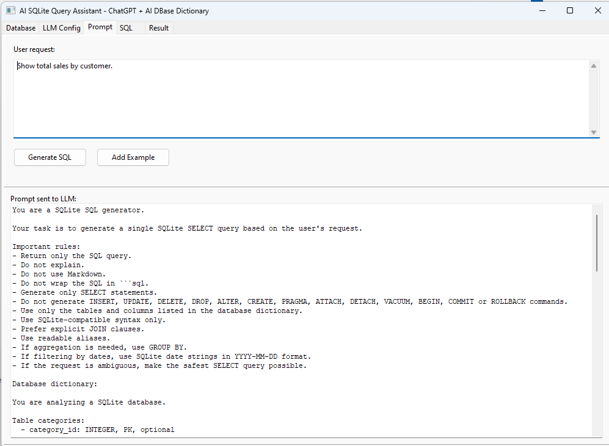

# AI SQLite Query Assistant Demo



This demo shows how to combine ChatGPT with the AI DBase Dictionary component to generate SQLite SELECT queries from natural language.

## Technologies used

- Lazarus
- ZeosLib
- SQLite
- TCHATGPT
- TAISQLiteDictionary
- TZConnection
- TZQuery
- TDataSource
- TDBGrid

## Workflow

1. Create a demo SQLite database.
2. Connect to the database using ZeosLib.
3. Generate the database dictionary using AI DBase Dictionary.
4. Type a natural language request.
5. Generate SQLite SQL using the LLM.
6. Review or edit the generated SQL.
7. Execute the SQL using ZeosLib.
8. View the result in a DBGrid.

## Configuration

The database path and LLM settings follow the same persisted-configuration
pattern used by `pg_schema_rag_demo`. They are stored in:

```text
%APPDATA%\maurinsoft\ai_sqlite_query_assistant_demo\ai_sqlite_query_assistant_demo.ini
```

The LLM configuration includes provider, API key, model, endpoint, timeout and
maximum tokens. Provider and model lists are obtained from the OpenAI package
helpers, while the model field remains editable for custom models.

## Windows target

The Lazarus project targets `i386-win32`. The `sqlite3.dll` distributed beside
the executable must therefore also be the 32-bit version.

## Demo database

The demo creates a sales database with the following tables:

- customers
- categories
- products
- promotions
- sales
- sale_items
- payments

## Example requests

- Show total sales by customer.
- List the best-selling products.
- Show sales with customer name, sale date and total amount.
- Show products that are currently in promotion.
- Show total revenue by payment method.
- Show pending sales.
- Show products with low stock.
- Show customers who bought notebooks.
- Show monthly sales totals.
- Show the top 5 customers by revenue.

## Safety

The demo only allows SELECT and WITH queries to be executed.

Commands such as INSERT, UPDATE, DELETE, DROP, ALTER, CREATE, PRAGMA, ATTACH, DETACH, VACUUM, BEGIN, COMMIT and ROLLBACK are blocked before execution.

If SQLite rejects a query, the application sends the SQLite error, failed SQL,
original request and database dictionary back to the LLM. It validates and
retries the corrected SQL, with a maximum of three execution attempts.

## Important note

All database access in this demo is performed using ZeosLib.

The demo does not use SQLDB, TSQLite3Connection, sqlite3conn or direct sqlite3 API calls.
