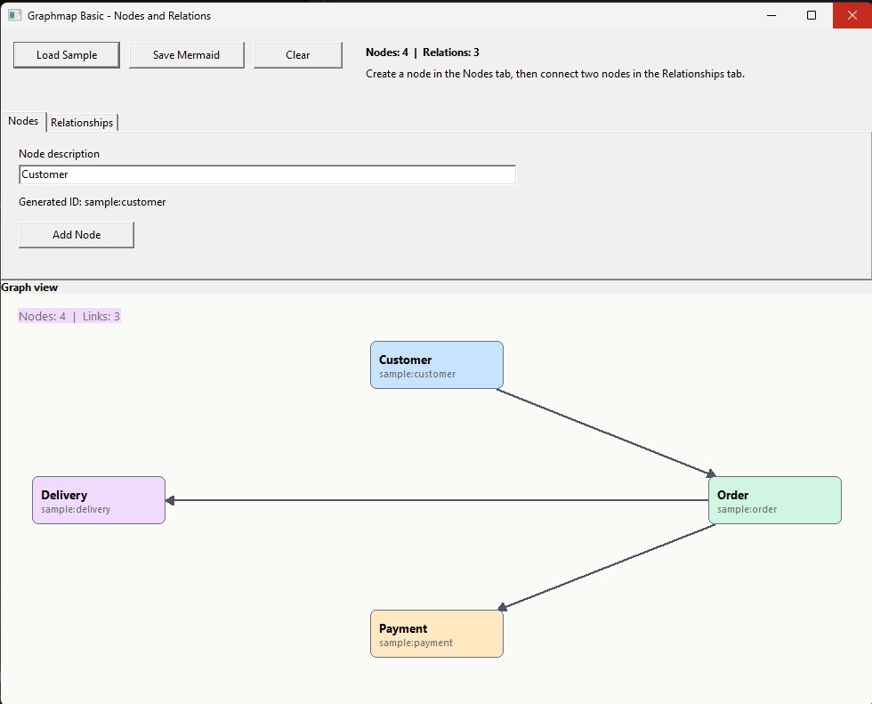

# graphmap_basic

Visual sample showing how to use `TAIDependencyGraph`.

## Preview

## How to use

- In the `Nodes` tab, enter a description and click `Add Node`.
- In the `Relationships` tab, choose two nodes and click `Create Relation`.
- The graph updates immediately in the lower panel.
- Use `Load Sample` to load a ready-made example.
- Use `Save Mermaid` to export the graph.

## What it demonstrates

- nodes created from a simple description
- relations between two nodes
- graphical visualization of the links
- Mermaid export of the graph
