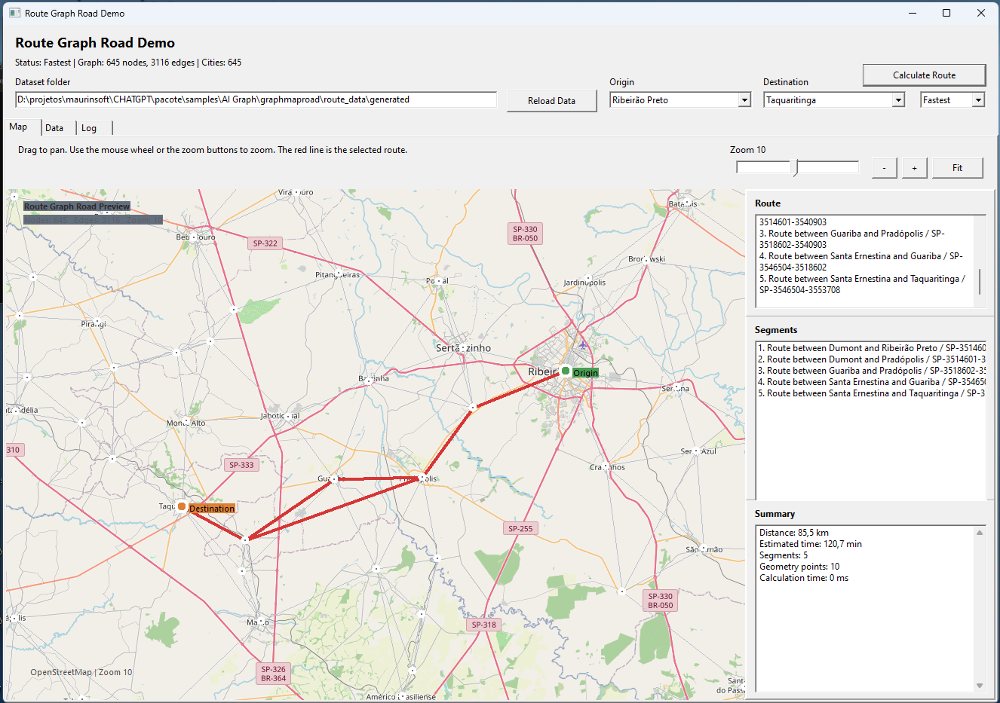

# Graph Map Road Demo

This sample shows a local road graph for Sao Paulo state using the visual form in `main.lfm`.

What it demonstrates:

- load a local GeoJSON dataset from `route_data\generated`;
- build a directed municipal route graph;
- connect cities to the nearest graph node;
- calculate a route between two cities;
- draw the graph and the selected route on top of OpenStreetMap tiles;
- show route distance, estimated time, and segment details.

Included demo data:

- `sp_route_nodes.geojson`
- `sp_route_edges.geojson`
- `sp_cities.geojson`
- `manifest.json`

The dataset is built from the 645 municipalities of Sao Paulo state and their generated connections, so the sample stays representative while still being easy to inspect.
City points use the municipal seat coordinates when available, which keeps the map markers closer to the real city positions.

How to use:

1. Open the project in Lazarus.
2. Run the sample.
3. Choose an origin and a destination.
4. Click `Calculate Route`.

Notes:

- The fastest and shortest modes may produce different results on some city pairs.
- The graph preview is drawn locally in the form, so no simulation mode is involved.
- The dataset generator lives next to the sample and can be rerun whenever you want to refresh the municipal graph.
- You can pan with the mouse and zoom with the mouse wheel or the buttons in the top bar.
