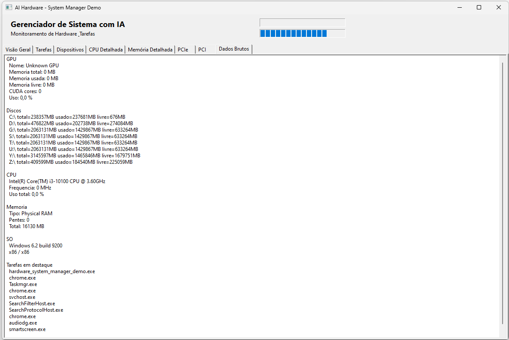

# AI Hardware - System Manager Demo

Demo visual do pacote `AI Hardware`, com foco em um painel no estilo:

- Gerenciador de Tarefas
- Gerenciador de Dispositivos

## O que mostra

- CPU: quantidade de CPUs, nucleos, cache, ID, frequencia e uso por nucleo
- Memoria: tipo, total, disponivel, usada e quantidade de pentes
- GPU: nome, memoria e uso
- Discos: quantidade, capacidade e espaco livre/usado
- SO: tipo, versao, bits e memoria virtual
- Tarefas: lista de processos com CPU e memoria

## Arquivos

- `hardware_system_manager_demo.lpr`
- `hardware_system_manager_demo.lpi`
- `main.pas`
- `main.lfm`

## Dependencias

- `AI Hardware`
- LCL

## Observacao

No Linux, CPU e memoria usam `/proc`, discos usam `statfs`, o sistema operacional
combina `/etc/os-release` com `uname` e a GPU consulta DRM em `/sys/class/drm`.
`TAIGPU.Available` informa se uma GPU foi encontrada e `TAIGPU.LastError`
explicita métricas que o driver não oferece. Ausência de backend nunca é
reportada como telemetria válida zerada.

## Screenshot

