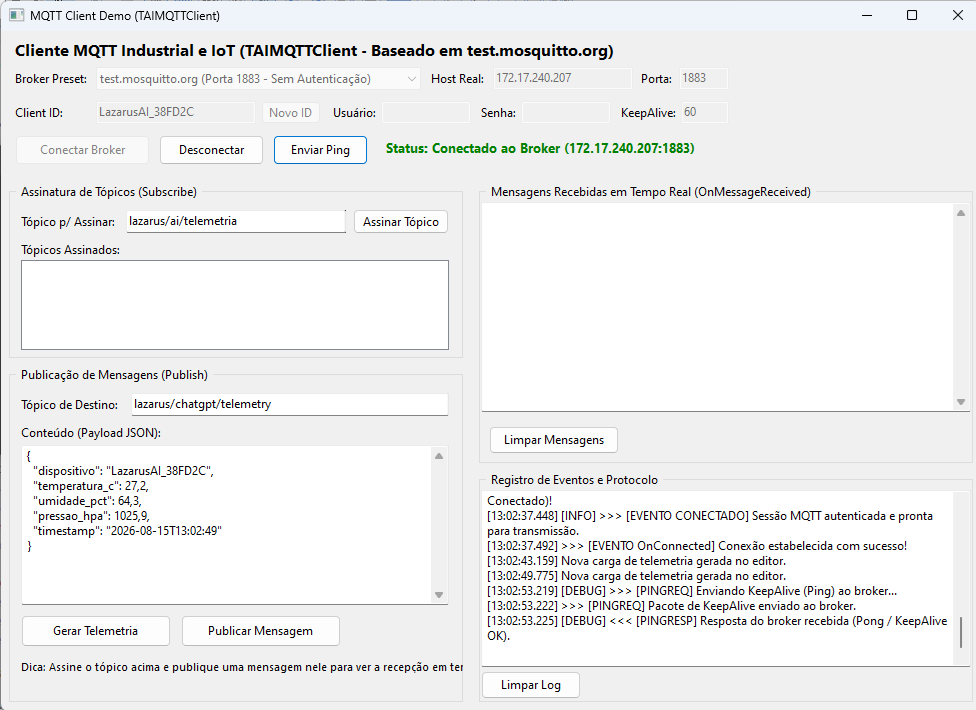

# MQTT Client Demo (TAIMQTTClient) — Baseado em test.mosquitto.org



Este projeto demonstra a utilização prática do componente `TAIMQTTClient` do pacote `openai_industrial` para comunicação IoT e automação industrial utilizando o protocolo real MQTT (v3.1.1), estruturado em conformidade com as diretrizes e perfis oficiais do servidor de testes **[test.mosquitto.org](https://test.mosquitto.org/)**.

## Perfis e Modos do test.mosquitto.org Suportados

De acordo com a especificação oficial de [test.mosquitto.org](https://test.mosquitto.org/):

1. **Porta 1883 (Não criptografado, Não autenticado)**:
   - Permite publicação em qualquer tópico.
   - Permite assinatura de qualquer tópico (exceto `#` isolado para proteção contra sobrecarga).
2. **Porta 1884 (Não criptografado, Autenticado)**:
   - **Usuário `rw` / Senha `readwrite`**: Acesso completo de leitura e escrita (Publish / Subscribe) na hierarquia `#`.
   - **Usuário `ro` / Senha `readonly`**: Acesso somente leitura (Subscribe) na hierarquia `#`.
   - **Usuário `wo` / Senha `writeonly`**: Acesso somente escrita (Publish) na hierarquia `#`.
3. **Descoberta Dinâmica com Usuário `wildcard` (Porta 1883)**:
   - Permite assinar temporariamente o tópico `#` por 20 segundos para descoberta de tópicos ativos na rede.
4. **Outros Brokers Públicos e Locais**:
   - `broker.hivemq.com` (Porta 1883)
   - `broker.emqx.io` (Porta 1883)
   - `localhost` (Broker local Mosquitto / Eclipse Mosquitto no host)

## Recursos Técnicos do Componente TAIMQTTClient

- **Autenticação MQTT v3.1.1**: Suporte completo às flags de User Name (`0x80`) e Password (`0x40`) e campos binários no payload do pacote `CONNECT`.
- **Resolução DNS Robusta**: Inicialização WinSock2 com detecção automática de IP numérico vs Hostname (`gethostbyname` / `ResolveHostByName`).
- **Log e Rastreamento Detalhado**: Monitoramento passo a passo em milissegundos `[hh:nn:ss.zzz]` de DNS, socket TCP, pacotes `CONNECT`, `CONNACK` (com decodificação de códigos de erro 0 a 5), `SUBSCRIBE`, `SUBACK`, `PUBLISH`, `PINGREQ` / `PINGRESP` e `DISCONNECT`.
- **Thread de Escuta em Background**: Recepção não-bloqueante de mensagens multi-pacote com decodificação de inteiros de comprimento variável e QoS 0/1/2.
- **Componente Visual**: Declarado nativamente no `.lfm` e paleta Lazarus.

## Como Compilar e Executar

1. Abra o projeto `mqtt_demo.lpi` no Lazarus.
2. Compile com `Ctrl+F9` ou via linha de comando:
   ```bash
   lazbuild mqtt_demo.lpi
   ```
3. Selecione o preset desejado (ex: `test.mosquitto.org (Porta 1883)` ou `test.mosquitto.org (Porta 1884 - rw/readwrite)`).
4. Clique em **"Conectar Broker"**, assine tópicos e envie dados de telemetria em tempo real.

> **Nota sobre redes corporativas**: Se a sua rede local ou firewall bloquear portas TCP de saída (como 1883/1884), utilize o perfil `localhost` executando um broker local do Mosquitto (`mosquitto -v`).
