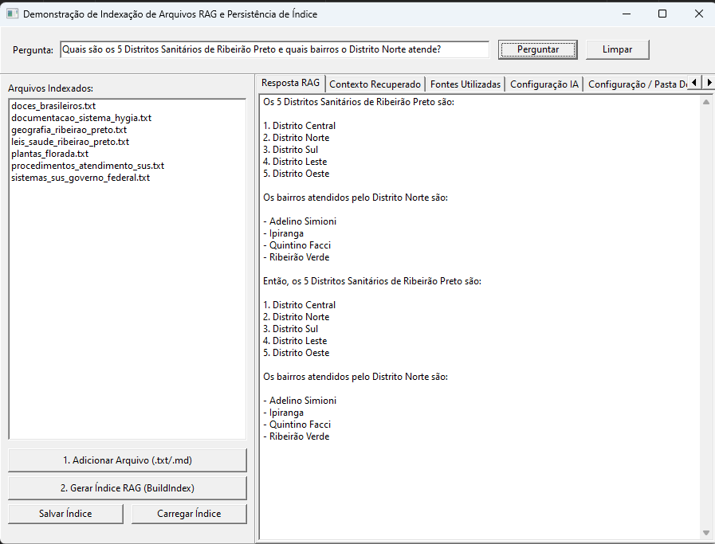

# RAG File Indexing Demo (`rag_file_indexing_demo`)

Demonstração do componente **`TAIRAG`** integrado ao **`TAIGraphMap`** e **`TCHATGPT`** para varredura de diretórios, fatiamento de documentos (chunking), indexação por grafo conectivo semântico e persistência de configurações e índice.

## 📌 Funcionalidades Principais

1. **Varredura e Fatiamento Dinâmico de Pastas (`AddFolder`)**:
   - Varre pastas locais de forma recursiva aplicando filtros configuráveis de extensão (`.txt`, `.md`, `.pas`, `.json`, `.csv`).
   - Fatiamento configurável em chunks com sobreposição (`ChunkSize` e `ChunkOverlap`).

2. **Indexação por Grafo Conectivo Semântico (`BuildIndex`)**:
   - Constrói o mapa de conexões entre tokens e palavras-chave através do `TAIGraphMap`.
   - Recuperação (retrieve) rápida e precisa do contexto mais relevante para cada consulta.

3. **Aba Dedicada de Configurações da IA (`tsConfigIA`)**:
   - **Provedores Suportados**: OpenAI, DeepSeek Direct API, Google Gemini, Anthropic Claude, OpenRouter, Cerebras e Local (Ollama / llama.cpp).
   - **Campos Configuráveis**: Chave API / Token, Seleção de Modelo, URL / Endpoint customizado, Timeout da requisição (segundos), Tamanho do Chunk, Overlap, Top K e Score Mínimo.

4. **Persistência em AppData**:
   - Salva e carrega automaticamente todas as preferências e parâmetros no arquivo `%APPDATA%\rag_file_indexing_demo\rag_config.ini`.

5. **Salvar e Carregar Grafo do Índice**:
   - Suporte a salvamento/carregamento do índice RAG treinado em arquivo binário (`.bin`) e treinamento em JSON (`.json`).

6. **Log RAG Detalhado (`tsLogs`)**:
   - Rastreamento completo de exceções, varredura, número de chunks criados, pontuação dos rankings de busca e a resposta exata devolvida pela IA.

## 🚀 Como Executar

1. Abra o arquivo de projeto `rag_file_indexing_demo.lpi` no Lazarus.
2. Compile com a tecla `F9` ou via `lazbuild`.
3. Alterne para a aba **Configuração IA**, informe seu Provedor e Chave de API (ou utilize modelos locais).
4. Clique em **Varrer e Indexar Pasta (AddFolder)** na aba **Configuração / Pasta Docs**.
5. Digite sua pergunta no painel superior e clique em **Perguntar**.
