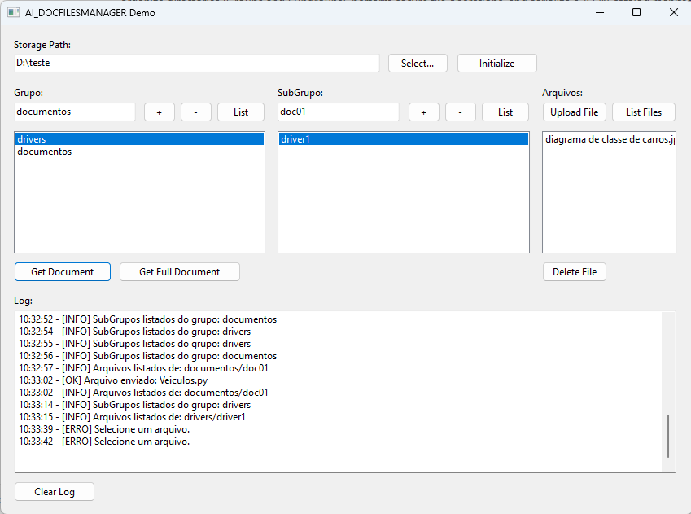
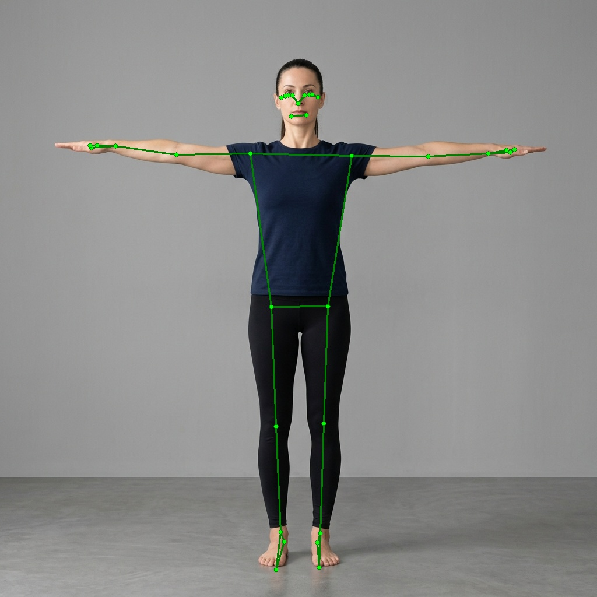
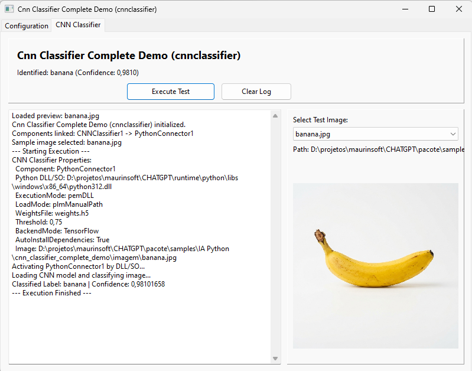
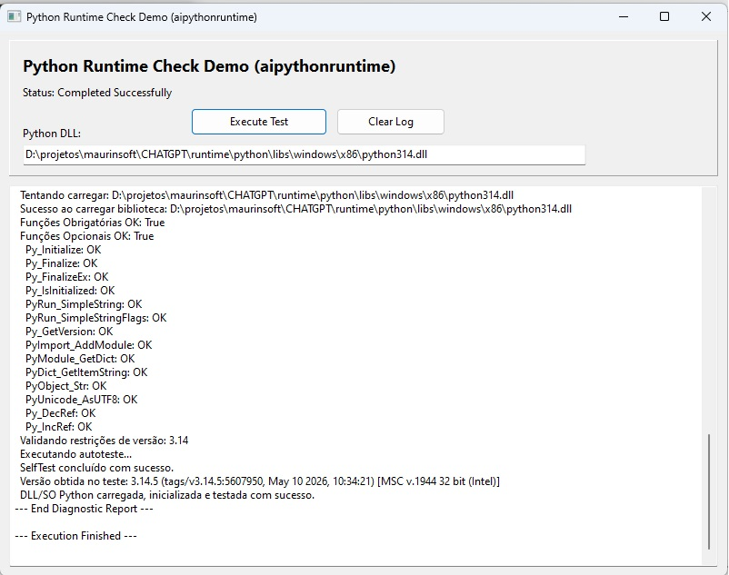
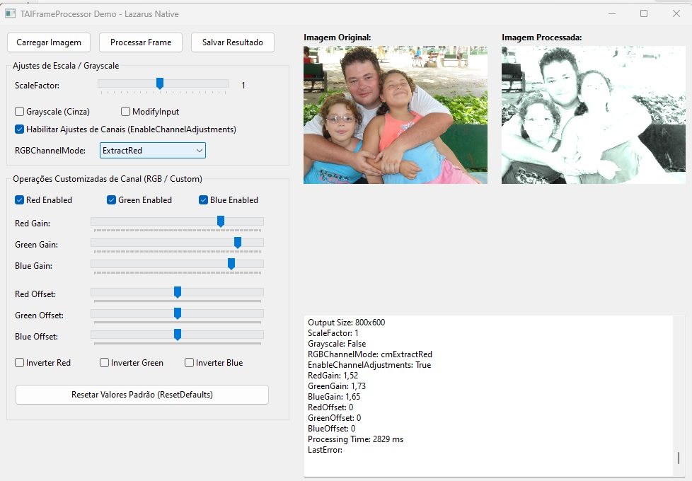
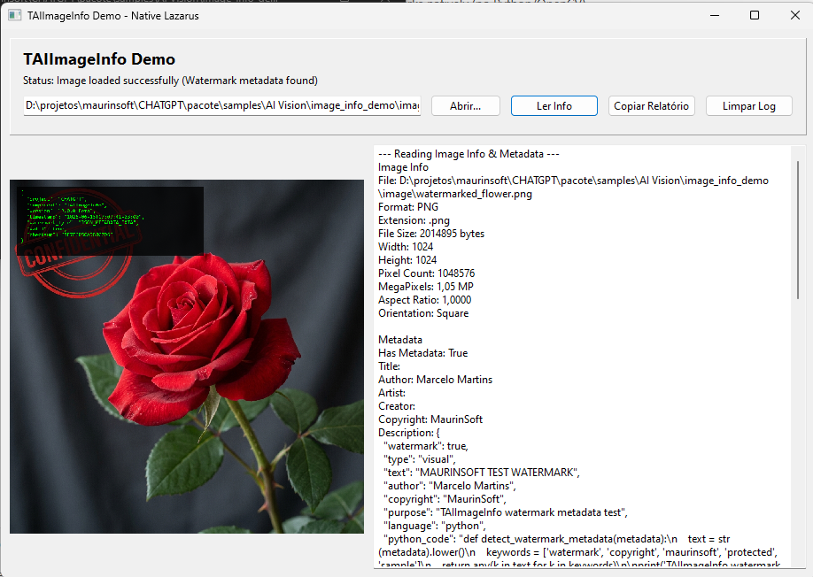
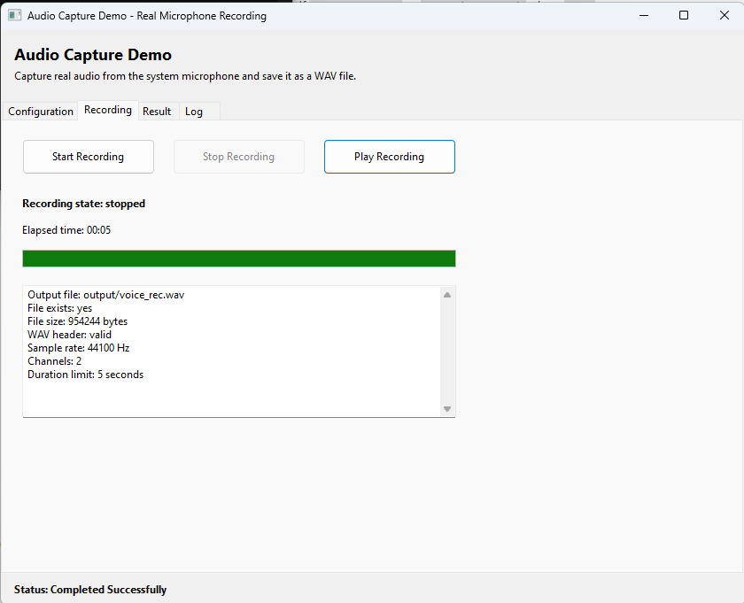
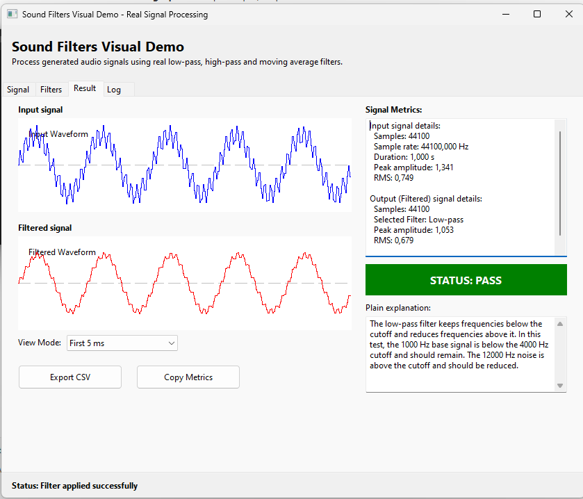
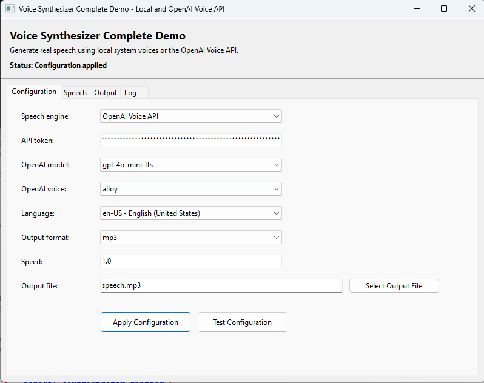

# 📂 Projetos de Demonstração (Samples)

> [!NOTE]
> Este diretório contém a suíte completa de exemplos desenvolvidos para demonstrar e testar todos os componentes de Inteligência Artificial, Aprendizado de Máquina (Machine Learning), Processamento de Imagens, Processamento de Sinais (DSP), Automação de Hardware e Geração de Documentos da Lazarus AI Suite.

## 🖥️ Demonstrações em Interface Gráfica (GUI)
Os exemplos a seguir são projetos visuais prontos para compilação e execução interativa através do Lazarus:

### 📦 AI

| Exemplo | Caminho | Descrição |
|---|---|---|
| **[cnn_demo](AI/cnn_demo/)**   | `pacote/samples/AI/cnn_demo` | Classificação de imagens usando redes convolucionais com TensorFlow e Python. |
| **[face_detection_demo](AI/face_detection_demo/)** | `pacote/samples/AI/face_detection_demo` | Detecção e rastreamento facial em tempo real com OpenCV. |
| **[graphmap_demo](AI/graphmap_demo/)** | `pacote/samples/AI/graphmap_demo` | Classificação e mapeamento de texto usando grafos de tokens ponderados. |
| **[lstm_demo](AI/lstm_demo/)** | `pacote/samples/AI/lstm_demo` | Previsão gráfica de séries temporais com modelo LSTM via Python. |
| **[neural_network_demo](AI/neural_network_demo/)** | `pacote/samples/AI/neural_network_demo` | Treinamento e visualização local de redes neurais multicamadas (MLP). |
| **[perceptron_demo](AI/perceptron_demo/)** | `pacote/samples/AI/perceptron_demo` | Visualizador interativo do treinamento de um perceptron simples de camada única. |
| **[python_demo](AI/python_demo/)**   | `pacote/samples/AI/python_demo` | Playground interativo para testes e execução de scripts Python. |
| **[som_demo](AI/som_demo/)**   | `pacote/samples/AI/som_demo` | Agrupamento topológico visual de cores usando redes Self-Organizing Maps. |
| **[tokenizer_demo](AI/tokenizer_demo/)** | `pacote/samples/AI/tokenizer_demo` | Demonstração de processamento, segmentação e tokenização de textos. |
| **[visual_demo](AI/visual_demo/)** | `pacote/samples/AI/visual_demo` | Playground unificado reunindo várias demonstrações visuais e abas de teste. |
| **[yolo_demo](AI/yolo_demo/)** | `pacote/samples/AI/yolo_demo` | Detecção profunda de objetos com YOLOv8 via integração Python. |

### 📦 AI Agent

| Exemplo | Caminho | Descrição |
|---|---|---|
| **[agent_demo](AI Agent/agent_demo/)** | `pacote/samples/AI Agent/agent_demo` | Simulação de agentes inteligentes autônomos para tomada de decisão e disparo de saídas. |

### 📦 AI Core

| Exemplo | Caminho | Descrição |
|---|---|---|
| **[codeassistant_demo](AI Core/codeassistant_demo/)** | `pacote/samples/AI Core/codeassistant_demo` | Assistente interativo de código para refatoração e documentação automática em Pascal. |
| **[modelregistry_demo](AI Core/modelregistry_demo/)** | `pacote/samples/AI Core/modelregistry_demo` | Gerenciamento e registro centralizado de modelos de linguagem inteligência artificial. |
| **[pipeline_full_demo](AI Core/pipeline_full_demo/)** | `pacote/samples/AI Core/pipeline_full_demo` | Criação e execução de pipelines complexos de processamento sequencial de texto. |
| **[promptbuilder_demo](AI Core/promptbuilder_demo/)** | `pacote/samples/AI Core/promptbuilder_demo` | Ferramenta visual de construção, modelagem e otimização de prompts de IA. |
| **[wizard_config_demo](AI Core/wizard_config_demo/)** | `pacote/samples/AI Core/wizard_config_demo` | Assistente interativo passo-a-passo para configuração inicial de projetos de IA. |

### 📦 AI DBase

| Exemplo | Caminho | Descrição |
|---|---|---|
| **[ai_sqlite_query_assistant_demo](AI DBase/ai_sqlite_query_assistant_demo/)**   | `pacote/samples/AI DBase/ai_sqlite_query_assistant_demo` | Assistente de consulta SQL em linguagem natural usando ChatGPT e SQLite. |
| **[db_dictionary_demo](AI DBase/db_dictionary_demo/)**   | `pacote/samples/AI DBase/db_dictionary_demo` | Extrator visual de dicionário de dados e metadados de bancos SQLite/PostgreSQL. |

### 📦 AI Files

| Exemplo | Caminho | Descrição |
|---|---|---|
| **[disk_tree_ai_dataset_demo](AI Files/disk_tree_ai_dataset_demo/)**   | `pacote/samples/AI Files/disk_tree_ai_dataset_demo` | Varredura e pesquisa de pastas em disco para montagem de bases de dados de IA. |
| **[docfilesmanager_demo](AI Files/docfilesmanager_demo/)**   | `pacote/samples/AI Files/docfilesmanager_demo` | Gerenciador estruturado de arquivos de documentação do projeto. |

### 📦 AI Filtros Sonoros

| Exemplo | Caminho | Descrição |
|---|---|---|
| **[sound_filters_demo](AI Filtros Sonoros/sound_filters_demo/)** | `pacote/samples/AI Filtros Sonoros/sound_filters_demo` | Nenhuma descrição disponível. |

### 📦 AI Graph

| Exemplo | Caminho | Descrição |
|---|---|---|
| **[dataset_analyzer_demo](AI Graph/dataset_analyzer_demo/)** | `pacote/samples/AI Graph/dataset_analyzer_demo` | Ferramenta gráfica de análise estatística de bases de treinamento. |
| **[graph_visualizer_demo](AI Graph/graph_visualizer_demo/)** | `pacote/samples/AI Graph/graph_visualizer_demo` | Visualizador interativo de grafos e nós relacionais de termos. |
| **[graphmap_basic](AI Graph/graphmap_basic/)** | `pacote/samples/AI Graph/graphmap_basic` | Versão básica em linha de comando de classificação por mapa de grafos. |
| **[training_exporter_demo](AI Graph/training_exporter_demo/)** | `pacote/samples/AI Graph/training_exporter_demo` | Exportador estruturado de dados de treinamento em mapas de relações. |
| **[training_report_demo](AI Graph/training_report_demo/)** | `pacote/samples/AI Graph/training_report_demo` | Gerador de relatórios visuais sobre o status do aprendizado em grafos. |

### 📦 AI Graphic

| Exemplo | Caminho | Descrição |
|---|---|---|
| **[avatar_demo](AI Graphic/avatar_demo/)** | `pacote/samples/AI Graphic/avatar_demo` | Playground visual de avatares com controle de esqueleto e malhas deformáveis. |
| **[model3d_viewer_demo](AI Graphic/model3d_viewer_demo/)** | `pacote/samples/AI Graphic/model3d_viewer_demo` | Visualizador interativo de modelos tridimensionais e controle de câmera. |
| **[opengl_graphic_demo](AI Graphic/opengl_graphic_demo/)** | `pacote/samples/AI Graphic/opengl_graphic_demo` | Renderização gráfica interactiva 3D com grids, luzes e OpenGL nativo. |
| **[physics_training_demo](AI Graphic/physics_training_demo/)** | `pacote/samples/AI Graphic/physics_training_demo` | Simulação física básica para treinamento de comportamento em tempo real. |
| **[pose_animation_demo](AI Graphic/pose_animation_demo/)** | `pacote/samples/AI Graphic/pose_animation_demo` | Biblioteca e sequenciador interativo de poses corporais em modelos 3D. |
| **[scene3d_demo](AI Graphic/scene3d_demo/)** | `pacote/samples/AI Graphic/scene3d_demo` | Visualizador de cena 3D e controle de múltiplas câmeras em OpenGL. |
| **[skeleton_rig_demo](AI Graphic/skeleton_rig_demo/)** | `pacote/samples/AI Graphic/skeleton_rig_demo` | Controle de esqueleto em malhas e deformação de vértices gráficos 3D. |
| **[tripo3d_demo](AI Graphic/tripo3d_demo/)** | `pacote/samples/AI Graphic/tripo3d_demo` | Geração de malhas 3D a partir de texto ou imagens usando a API Tripo3D. |

### 📦 AI Image

| Exemplo | Caminho | Descrição |
|---|---|---|
| **[image_filters_demo](AI Image/image_filters_demo/)** | `pacote/samples/AI Image/image_filters_demo` | Processamento matricial de filtros de imagem nativos em canvas Pascal. |

### 📦 AI Industrial

| Exemplo | Caminho | Descrição |
|---|---|---|
| **[industrial_bridge_demo](AI Industrial/industrial_bridge_demo/)** | `pacote/samples/AI Industrial/industrial_bridge_demo` | Ponte de comunicação industrial ligando brokers IoT e CLPs. |
| **[modbus_demo](AI Industrial/modbus_demo/)** | `pacote/samples/AI Industrial/modbus_demo` | Demonstração de leitura/escrita física no protocolo industrial Modbus. |
| **[mqtt_demo](AI Industrial/mqtt_demo/)** | `pacote/samples/AI Industrial/mqtt_demo` | Conexão e publicação de eventos em brokers MQTT. |

### 📦 AI Input

| Exemplo | Caminho | Descrição |
|---|---|---|
| **[capture_source_demo](AI Input/capture_source_demo/)** | `pacote/samples/AI Input/capture_source_demo` | Demonstração de captura física de frames a partir de múltiplas fontes. |
| **[chromium_capture_demo](AI Input/chromium_capture_demo/)** | `pacote/samples/AI Input/chromium_capture_demo` | Captura visual programada de telas de navegadores embarcados (CEF). |
| **[email_classifier_demo](AI Input/email_classifier_demo/)** | `pacote/samples/AI Input/email_classifier_demo` | Classificação inteligente e triagem automatizada de caixas de entrada de e-mails. |
| **[hardware_net_demo](AI Input/hardware_net_demo/)** | `pacote/samples/AI Input/hardware_net_demo` | Demonstração de integração com câmeras, brokers MQTT, e-mails e pontes CLP. |
| **[serial_demo](AI Input/serial_demo/)** | `pacote/samples/AI Input/serial_demo` | Comunicação direta bidirecional com portas seriais e Arduino. |
| **[socket_server_client_demo](AI Input/socket_server_client_demo/)** | `pacote/samples/AI Input/socket_server_client_demo` | Servidor e cliente TCP/UDP nativo para troca rápida de pacotes de dados. |
| **[webserver_demo](AI Input/webserver_demo/)** | `pacote/samples/AI Input/webserver_demo` | Servidor HTTP leve nativo para disponibilizar serviços locais. |

### 📦 AI ML

| Exemplo | Caminho | Descrição |
|---|---|---|
| **[dataset_generator_visual_demo](AI ML/dataset_generator_visual_demo/)** | `pacote/samples/AI ML/dataset_generator_visual_demo` | Interface visual Lazarus para criação e exportação estruturada de datasets. |
| **[matrix_component_demo](AI ML/matrix_component_demo/)** | `pacote/samples/AI ML/matrix_component_demo` | Showcase de operações avançadas com matrizes matemáticas em Pascal puro. |
| **[numps_demo](AI ML/numps_demo/)** | `pacote/samples/AI ML/numps_demo` | Integração visual Pascal para computação científica com o NUMPS. |

### 📦 AI Math

| Exemplo | Caminho | Descrição |
|---|---|---|
| **[math_input_output_demo](AI Math/math_input_output_demo/)**   | `pacote/samples/AI Math/math_input_output_demo` | Visualizador e processador de dados matemáticos de entrada e saída. |

### 📦 AI MediaPipe Vision

| Exemplo | Caminho | Descrição |
|---|---|---|
| **[pose_detector_demo](AI MediaPipe Vision/pose_detector_demo/)**   | `pacote/samples/AI MediaPipe Vision/pose_detector_demo` | Rastreamento corporal de articulações em tempo real com MediaPipe. |

### 📦 AI Native Vision

| Exemplo | Caminho | Descrição |
|---|---|---|
| **[motion_tracker_demo](AI Native Vision/motion_tracker_demo/)** | `pacote/samples/AI Native Vision/motion_tracker_demo` | Identificação e rastreamento óptico de movimentos em tempo real. |
| **[native_image_filter_demo](AI Native Vision/native_image_filter_demo/)** | `pacote/samples/AI Native Vision/native_image_filter_demo` | Filtros gráficos nativos de alto desempenho baseados em CPU. |

### 📦 AI Output

| Exemplo | Caminho | Descrição |
|---|---|---|
| **[output_docs_demo](AI Output/output_docs_demo/)** | `pacote/samples/AI Output/output_docs_demo` | Motor de exportação estruturada para múltiplos formatos documentais. |
| **[output_text_json_demo](AI Output/output_text_json_demo/)** | `pacote/samples/AI Output/output_text_json_demo` | Geração de strings formatadas em texto estruturado e JSON. |
| **[pdf_word_excel_demo](AI Output/pdf_word_excel_demo/)** | `pacote/samples/AI Output/pdf_word_excel_demo` | Exportação nativa Pascal para PDF, planilhas Excel e arquivos Word. |
| **[posprinter_demo](AI Output/posprinter_demo/)** | `pacote/samples/AI Output/posprinter_demo` | Utilitário de formatação física de comandos ESC/POS para impressoras térmicas. |
| **[word_object_demo](AI Output/word_object_demo/)** | `pacote/samples/AI Output/word_object_demo` | Manipulação real e edição estruturada de arquivos DOCX via OpenXML. |
| **[word_viewer_demo](AI Output/word_viewer_demo/)** | `pacote/samples/AI Output/word_viewer_demo` | Visualizador nativo e renderizador de documentos DOCX dentro de formulários Lazarus. |

### 📦 AI Python

| Exemplo | Caminho | Descrição |
|---|---|---|
| **[cnn_classifier_complete_demo](AI Python/cnn_classifier_complete_demo/)**   | `pacote/samples/AI Python/cnn_classifier_complete_demo` | Demo completo de classificação visual por redes neurais convolucionais (CNN). |
| **[lstm_timeseries_demo](AI Python/lstm_timeseries_demo/)** | `pacote/samples/AI Python/lstm_timeseries_demo` | Predição e análise estatística de séries temporais usando modelos LSTM. |
| **[python_runtime_check_demo](AI Python/python_runtime_check_demo/)**   | `pacote/samples/AI Python/python_runtime_check_demo` | Utilitário de verificação e diagnóstico de runtimes Python instalados. |
| **[yolo_detection_complete_demo](AI Python/yolo_detection_complete_demo/)** | `pacote/samples/AI Python/yolo_detection_complete_demo` | Demo visual completo de detecção de objetos YOLOv8. |

### 📦 AI Schedule

| Exemplo | Caminho | Descrição |
|---|---|---|
| **[schedule_demo](AI Schedule/schedule_demo/)** | `pacote/samples/AI Schedule/schedule_demo` | Gerenciamento estruturado de cronogramas e fila de tarefas baseadas em cron. |

### 📦 AI Simulation

| Exemplo | Caminho | Descrição |
|---|---|---|
| **[contamination_demo](AI Simulation/contamination_demo/)** | `pacote/samples/AI Simulation/contamination_demo` | Simulação didática de proximidade e propagação de contaminação gráfica 2D. |
| **[robot_grid_demo](AI Simulation/robot_grid_demo/)** | `pacote/samples/AI Simulation/robot_grid_demo` | Simulação interativa de robôs buscando estações de carga de forma autônoma. |
| **[service_queue_demo](AI Simulation/service_queue_demo/)** | `pacote/samples/AI Simulation/service_queue_demo` | Simulação visual de fila de atendimento dinâmico (hospitalar, comercial, bancário). |
| **[warehouse_agents_demo](AI Simulation/warehouse_agents_demo/)** | `pacote/samples/AI Simulation/warehouse_agents_demo` | Simulação logística e movimentação autônoma de empilhadeiras em armazém. |

### 📦 AI Vision

| Exemplo | Caminho | Descrição |
|---|---|---|
| **[aiframeprocessor_demo](AI Vision/aiframeprocessor_demo/)**   | `pacote/samples/AI Vision/aiframeprocessor_demo` | Processador genérico de frames e pixels nativo sem dependências OpenCV. |
| **[camera_capture_windows_demo](AI Vision/camera_capture_windows_demo/)** | `pacote/samples/AI Vision/camera_capture_windows_demo` | Utilitário de captura de vídeo de dispositivos USB no Windows. |
| **[frame_diff_demo](AI Vision/frame_diff_demo/)** | `pacote/samples/AI Vision/frame_diff_demo` | Detecção simplificada de movimento por diferença acumulada de frames consecutivas. |
| **[image_info_demo](AI Vision/image_info_demo/)**   | `pacote/samples/AI Vision/image_info_demo` | Exibição e leitura rápida de cabeçalhos e metadados de arquivos de imagem. |
| **[opencv_filter_demo](AI Vision/opencv_filter_demo/)** | `pacote/samples/AI Vision/opencv_filter_demo` | Filtros de imagem básicos em OpenCV usando LCL e formulários. |
| **[opencv_image_real_demo](AI Vision/opencv_image_real_demo/)** | `pacote/samples/AI Vision/opencv_image_real_demo` | Demonstração de integração OpenCV e LCL em tempo real. |
| **[opencv_vision_demo](AI Vision/opencv_vision_demo/)** | `pacote/samples/AI Vision/opencv_vision_demo` | Playground visual completo de controle de câmera, filtros e face tracking OpenCV. |

### 📦 AI Voice

| Exemplo | Caminho | Descrição |
|---|---|---|
| **[audio_capture_demo](AI Voice/audio_capture_demo/)**   | `pacote/samples/AI Voice/audio_capture_demo` | Demo gráfico para captura real de áudio do microfone, salvando em WAV, sem modo simulado. |
| **[sound_filters_visual_demo](AI Voice/sound_filters_visual_demo/)**   | `pacote/samples/AI Voice/sound_filters_visual_demo` | Equalizador e painel visual de filtros sonoros aplicados em tempo real. |
| **[voice_synthesizer_complete_demo](AI Voice/voice_synthesizer_complete_demo/)**   | `pacote/samples/AI Voice/voice_synthesizer_complete_demo` | Demo gráfico completo para síntese real de voz usando vozes locais do sistema ou a API de voz da OpenAI. |
| **[voicesynthesizer_demo](AI Voice/voicesynthesizer_demo/)**   | `pacote/samples/AI Voice/voicesynthesizer_demo` | Demonstração de sintetização de voz (Text-to-Speech) nativa e multiplataforma. |

## 💻 Demonstrações em Linha de Comando (Console)
Estes exemplos demonstram a invocação direta de componentes via linha de comando para cenários de depuração rápida ou automação de rotinas:

### ⌨️ AI

| Exemplo | Caminho | Descrição |
|---|---|---|
| **[aicodeassistant_sample.lpr](AI/aicodeassistant_sample.lpr)** | `pacote/samples/AI/aicodeassistant_sample.lpr` | Rotina em console para otimização e documentação automática de código pascal. |
| **[aidatasetgenerator_sample.lpr](AI/aidatasetgenerator_sample.lpr)** | `pacote/samples/AI/aidatasetgenerator_sample.lpr` | Loop de compilação e exportação de base de dados em formato JSONL. |
| **[chatgpt_sample.lpr](AI/chatgpt_sample.lpr)** | `pacote/samples/AI/chatgpt_sample.lpr` | Envio de perguntas e auditoria de respostas brutas em OpenAI, Claude e Gemini. |
| **[neuralnetwork_sample.lpr](AI/neuralnetwork_sample.lpr)** | `pacote/samples/AI/neuralnetwork_sample.lpr` | Treinamento clássico de perceptron multicamadas XOR em Pascal puro. |

### ⌨️ AI Input

| Exemplo | Caminho | Descrição |
|---|---|---|
| **[aiinput_sample.lpr](AI Input/aiinput_sample.lpr)** | `pacote/samples/AI Input/aiinput_sample.lpr` | Demonstração em linha de comando de envio/recebimento de dados usando componentes da aba AI Input. |

### ⌨️ AI Math

| Exemplo | Caminho | Descrição |
|---|---|---|
| **[numps_sample.lpr](AI Math/numps_sample.lpr)** | `pacote/samples/AI Math/numps_sample.lpr` | Demonstração simples de console para operações matemáticas de matrizes e vetores com o NUMPS. |

### ⌨️ AI Output

| Exemplo | Caminho | Descrição |
|---|---|---|
| **[aioutput_sample.lpr](AI Output/aioutput_sample.lpr)** | `pacote/samples/AI Output/aioutput_sample.lpr` | Demonstração de console do componente de saída de dados estruturados em JSON ou texto puro. |
| **[math_output_docs_demo.lpr](AI Output/math_output_docs_demo.lpr)** | `pacote/samples/AI Output/math_output_docs_demo.lpr` | Geração simplificada de documentos e planilhas matemáticas via linha de comando. |

### ⌨️ AI Voice

| Exemplo | Caminho | Descrição |
|---|---|---|
| **[aivoicesynthesizer_sample.lpr](AI Voice/aivoicesynthesizer_sample.lpr)** | `pacote/samples/AI Voice/aivoicesynthesizer_sample.lpr` | Invocação direta de sintetização síncrona/assíncrona de voz via console. |
