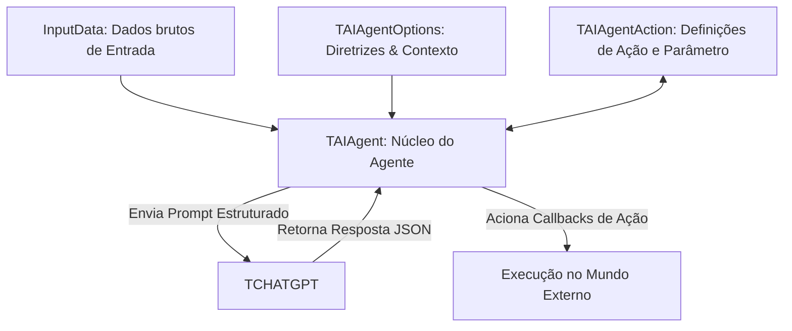

# Playground de Agente Autônomo e Tomada de Decisão (TAIAgent)

Este projeto demonstra a utilização prática do novo conjunto de componentes autônomos sob a aba **IA Agent** do Lazarus IDE. A aplicação exemplifica como configurar agentes inteligentes capazes de receber instruções, analisar contextos do mundo real e escolher a melhor ação a ser executada externamente, com retorno e tratamento estruturado via JSON nativo.

## Visão Geral

O projeto consiste em um dashboard interativo (Playground) para testar e validar o comportamento de agentes inteligentes em cenários dinâmicos. A aplicação vem pré-carregada com dois cenários simulados:
1. **Alerta de Servidor (Infraestrutura/TI)**: O agente monitora a temperatura de um servidor crítico e despacha comandos de resfriamento ou manutenção caso ultrapasse limites de segurança.
2. **Ticket de Entrega (Comércio Eletrônico)**: O agente faz a triagem de mensagens de clientes e encaminha para departamentos como financeiro ou logística com base na urgência identificada.

---

## Funcionalidades Principais

* **Orquestração de Agente Autônomo**: Integração nativa do componente `TAIAgent` com o conector `TCHATGPT` para raciocínio analítico estruturado.
* **Diretrizes e Contexto Flexíveis**: Definição dinâmica de perguntas (`TAIAgentOptions.Questions`) e contexto operacional (`Context`) do agente.
* **Ações Estruturadas com Parâmetros**: Configuração de ações permitidas no mundo externo (`TAIAgentAction.AllowedActions`) e parametrização exigida (`ParameterDefinitions`).
* **Parsing de JSON Nativo**: Processamento robusto e seguro do payload de resposta utilizando a biblioteca FCL do Free Pascal (`GetJSON` e `TJSONObject`), tratando e exibindo em tempo real a decisão, o raciocínio (`Rationale`) e a listagem de parâmetros.
* **Multi-Provedor**: Seleção interativa de provedores de IA como OpenAI, OpenRouter, Cerebras, Ollama Local, Google Gemini e Anthropic Claude.

---

## Como Funciona

A arquitetura do Agente baseia-se na união de três componentes principais trabalhando juntos:



### Código de Inicialização e Ligação

```pascal
// Instanciação e ligação dos componentes em tempo de execução
FChatGPT := TCHATGPT.Create(Self);
FAIAgent := TAIAgent.Create(Self);
FAIAgentOptions := TAIAgentOptions.Create(Self);
FAIAgentAction := TAIAgentAction.Create(Self);

// Vinculação de dependências
FAIAgent.ChatGPT := FChatGPT;
FAIAgent.Options := FAIAgentOptions;
FAIAgent.Action := FAIAgentAction;
FAIAgentOptions.Action := FAIAgentAction;

// Definição de eventos e callbacks de ação externa
FAIAgentAction.OnExecuteAction := @OnAgentExecuteAction;
```

---

## Como Compilar e Executar

### Pré-requisitos
* Lazarus IDE instalado com Free Pascal Compiler (FPC) 3.2.2 ou superior.
* Pacote `openai.lpk` devidamente compilado e instalado no seu ambiente Lazarus.

### Passos de Compilação
1. Abra o arquivo de projeto `agent_demo.lpi` no Lazarus.
2. Compile a aplicação pressionando `Ctrl + F9` ou selecione o menu **Executar > Construir**.
3. Como alternativa via linha de comando (CLI):
   ```powershell
   C:\lazarus\lazbuild.exe agent_demo.lpi
   ```

### Executando a Demonstração
1. Execute o arquivo executável gerado `agent_demo.exe`.
2. Configure seu provedor de IA no painel superior (caso use OpenAI/Gemini/Claude, insira sua Chave API no campo de Token).
3. Selecione um dos cenários de demonstração ("Alerta de Servidor" ou "Ticket de Entrega") para preencher instantaneamente as regras de negócio.
4. Clique em **Executar Decisão do Agente** e veja a tomada de decisão do LLM em tempo real no painel à direita!
